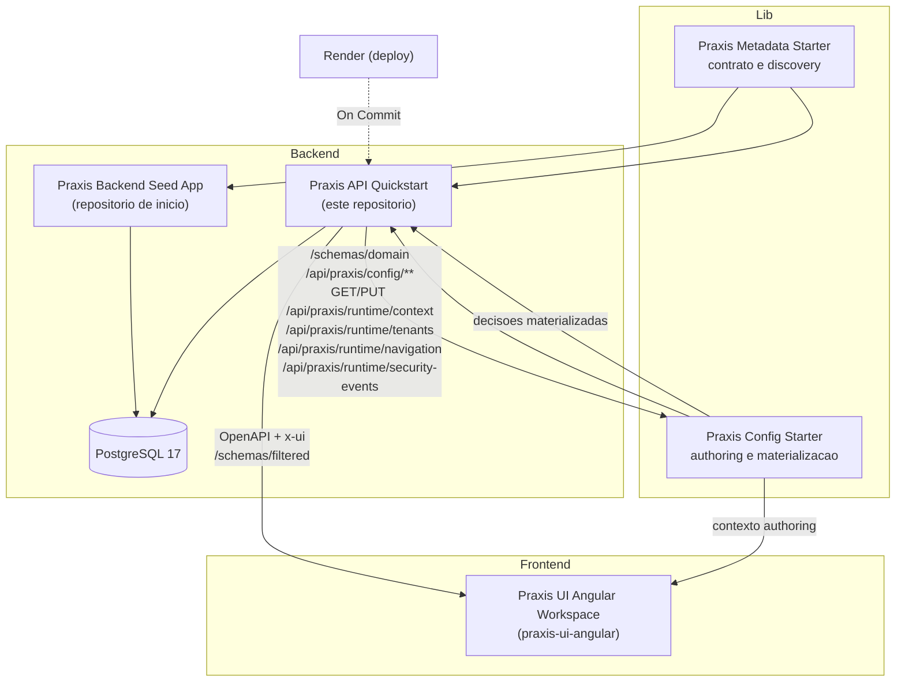
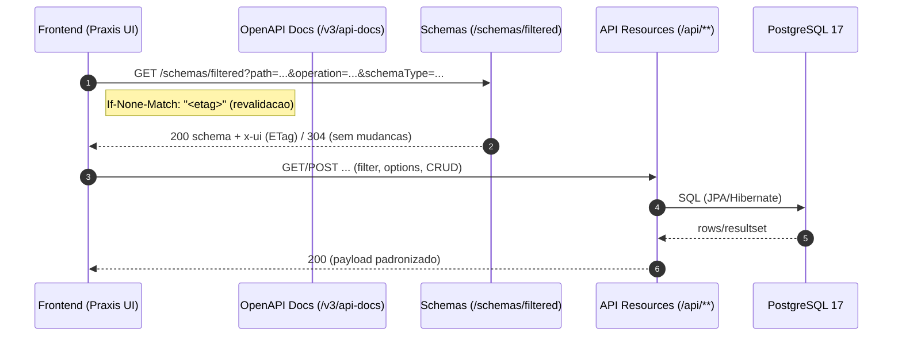

[](https://github.com/codexrodrigues/praxis-api-quickstart/actions/workflows/ci-java.yml)
[](https://spring.io/projects/spring-boot)
[](https://adoptium.net)
[](https://github.com/codexrodrigues/praxis-api-quickstart/commits)
[](LICENSE)

# API Quickstart (Praxis AI-Ready Host)


**Demo (Render)**
- [Home publica](https://praxis-api-quickstart.onrender.com/)
- [Praxis Cockpit](https://praxis-api-quickstart.onrender.com/praxis/cockpit)
- [Swagger UI](https://praxis-api-quickstart.onrender.com/swagger-ui/index.html)
- [Health](https://praxis-api-quickstart.onrender.com/actuator/health)
- [Build info](https://praxis-api-quickstart.onrender.com/actuator/info)

O [Praxis Cockpit](https://praxis-api-quickstart.onrender.com/praxis/cockpit) e a forma mais rapida de entender este host sem clonar o projeto. Ele e servido automaticamente pelo `praxis-metadata-starter`, nao por HTML copiado no Quickstart, e mostra como o dominio publicado pelo backend vira inventario navegavel: areas de negocio, recursos, endpoints, filtros, tabelas, formularios, graficos, workflow actions, prontidao semantica e relacionamentos entre recursos.

Compartilhe sempre a URL canonica `/praxis/cockpit`. Parametros como `release`, `published` e `qa` sao cache-busters temporarios para validacao; o topo do cockpit mostra o release solicitado e o `build.time` real de `/actuator/info` para confirmar se o Render ja serviu o build esperado.

Leia tambem [`docs/COCKPIT-QUICKSTART-REFERENCE.md`](docs/COCKPIT-QUICKSTART-REFERENCE.md) para entender como o cockpit deve ser usado como evidencia do host exemplar: cobertura por dominio, surfaces, workflow actions, charts, relacionamentos navegaveis e prioridades de evolucao do Quickstart.
O inventario desse guia e conferido contra o runtime publicado por `scripts/verify-cockpit-inventory-doc.sh`, evitando que numeros de recursos, surfaces e workflow actions fiquem obsoletos.
Os contratos de actions tambem sao conferidos por `scripts/verify-cockpit-action-contracts.sh`, garantindo que cada workflow publicado tenha path OpenAPI e schemas filtrados de request/response para o cockpit materializar formulario e retorno.
As surfaces semanticas explicitas sao conferidas por `scripts/verify-cockpit-surface-contracts.sh`, garantindo que cada experiencia composta publicada para o cockpit tenha titulo, descricao, path OpenAPI e schema filtrado materializavel.
Os relacionamentos navegaveis usados pelo diagrama do cockpit sao conferidos por `scripts/verify-cockpit-related-resource-contracts.sh`, garantindo que cada `relatedResource` aponte para surface, schema, campo pai, chave de selecao e, quando houver recurso filho real, operacoes OpenAPI coerentes.
Os contratos de analytics e charts sao conferidos por `scripts/verify-cockpit-analytics-contracts.sh`, garantindo que endpoints `/stats/*` publiquem schemas filtrados de request/response e que surfaces `CHART` apontem para projecoes `praxis.stats`.
Os lookups governados sao conferidos por `scripts/verify-cockpit-option-source-contracts.sh`, garantindo que `x-ui.optionSource` publicado em schemas filtrados tenha endpoints de busca e reidratacao materializaveis para filtros e formularios do cockpit.
Os contratos estruturais de UI sao conferidos por `scripts/verify-cockpit-structural-ui-contracts.sh`, garantindo que recursos publicados tenham schemas filtrados materializaveis para leitura, filtros, tabelas, criacao e edicao sempre que essas operacoes existirem no OpenAPI.

## Sobre o Praxis (visao geral)

O Praxis e uma plataforma de decisoes semanticas authoradas por IA. Em vez de tratar a IA como geradora de JSON, patches ou configuracao incidental de componente, o backend publica intencao, vocabulario de dominio, governanca, capacidades e evidencias em runtime; a camada de config governa simulacao, aprovacao, publicacao e materializacoes derivadas.

- AI-ready host: o quickstart publica `/schemas/domain`, `@ApiResource(resourceKey=...)`, `@Operation`, `@Schema`, `@DomainGovernance`, capabilities, actions, option sources e stats para que a IA aprenda o negocio sem ler codigo-fonte.
- Semantic grounding: o catalogo emitido pelo host e ingerido em `/api/praxis/config/domain-catalog/**`, onde vira contexto recuperavel para prompt, authoring e auditoria.
- Governed authoring: regras e conhecimento adicional passam por Project Knowledge, Domain Knowledge change sets e `domain-rules` antes de qualquer materializacao.
- Materialization-driven runtime: UI, option sources, validations e workflow actions consomem decisoes publicadas; elas nao redefinem a regra de negocio.
- Contract-driven UI: `/schemas/filtered`, OpenAPI enriquecido com `x-ui`, capabilities e HATEOAS continuam sendo as superficies estruturais que o runtime oficial usa para montar tabelas, formularios, actions e dashboards.
- Evolucao segura: `ETag`/`If-None-Match`, `If-Match`, headers de schema e versoes logicas evitam quebras e preservam cache/revalidacao do contrato.

Beneficios
- A IA escolhe recursos, campos e fluxos por evidencias publicadas, nao por nomes hardcoded.
- O host demonstra como decisoes governadas sao simuladas, aprovadas, publicadas e consumidas em runtime.
- A UI oficial continua dinamica, mas como cockpit e runtime de decisoes materializadas, nao como fonte primaria da regra.
- Novos negocios podem copiar o padrao de grounding/governanca sem copiar heuristicas de RH, missoes ou procurement.

Como a UI consome o contrato
- Endpoints publicos: `/v3/api-docs` (por grupo) e `/schemas/filtered` (schema filtrado por operacao: request/response).
- O `schemas/filtered` mescla metadados das anotacoes, Bean Validation e hints do OpenAPI.

Como a IA consome o contexto
- O host emite `GET /schemas/domain?resourceKey=<resourceKey>` a partir de metadata, OpenAPI, DTOs, governanca e capacidades.
- `scripts/ensure-domain-catalog-context.sh` ingere a release em `POST /api/praxis/config/domain-catalog/ingest`.
- `scripts/verify-domain-catalog-context.sh` valida contexto e governanca persistidos.
- `scripts/verify-domain-catalog-authoring-runtime.sh`, `scripts/verify-domain-rules-runtime.sh` e `scripts/verify-domain-knowledge-change-set-runtime.sh` provam authoring, regras governadas e conhecimento adicional em HTTP real.

## Universo dos Herois (dominio de exemplo)

Este Quickstart usa um dominio tematico de herois para demonstrar CRUDs, relacionamentos, analytics, actions, governanca e regras de negocio em um contexto ludico e familiar.

- Plataforma: Spring Boot 3 (Java 21) + PostgreSQL 17
- Objetivo: oferecer uma base rica de dados, endpoints REST e superficies semanticas para provar o ecossistema Praxis (Metadata Starter, Config Starter e UI oficial)

Modulos principais (exemplos didaticos)
-  Recursos Humanos - funcionarios, cargos, departamentos, historico, enderecos, dependentes
-  Habilidades & Identidades - habilidades, vinculos funcionario<->habilidade, identidades secretas
-  Bases & Equipes - bases operacionais, equipes e niveis de acesso
-  Missoes & Ameacas - ameacas, missoes, participantes e eventos
-  Logistica & Tecnologia - equipamentos, veiculos e alocacoes
-  Compliance & Incidentes - acordos, licencas, incidentes e indenizacoes
-  Comunicacao & Midia - sinais de socorro, reputacao, mencoes na imprensa

Observacao: este Quickstart agora separa os recursos por dominio de rota, em vez de concentrar tudo sob `human-resources`.

- `human-resources`: `/api/human-resources/...`
- `operations`: `/api/operations/...`
- `assets`: `/api/assets/...`
- `risk-intelligence`: `/api/risk-intelligence/...`
- `demo`: `/api/demo/...`

Para uma visao detalhada (tabelas, views e cenarios), veja: `docs/DEMO-DATABASE.md`.

Migrations operacionais da API:
- O datasource de dominio do Quickstart (`spring.datasource.*`) e separado do datasource config/RAG (`config.datasource.*`).
- A trilha versionada de schema/seed operacional fica em [`db/operational-migrations`](db/operational-migrations).
- O processo de aplicacao e o drift check estao em [`docs/OPERATIONAL-DATASOURCE-MIGRATIONS.md`](docs/OPERATIONAL-DATASOURCE-MIGRATIONS.md).

## Ecossistema (pecas e papeis)

- Praxis Metadata Starter (biblioteca)
  - Fornece anotacoes e bases para publicar contratos ricos: `@ApiResource`, `@ApiGroup`, `@UISchema`, `@DomainGovernance` e `@AiUsagePolicy`.
  - Enriquecimento OpenAPI com extensao x-ui, `/schemas/filtered`, `/schemas/domain`, capabilities, actions, option sources, stats e integracoes JPA.
  - Principais pacotes usados aqui: `org.praxisplatform.uischema.annotation`, `org.praxisplatform.uischema.controller.base`, `org.praxisplatform.uischema.service.base`, `org.praxisplatform.uischema.filter`.
- Praxis Config Starter (biblioteca)
  - Hospeda `/api/praxis/config/**`, `GET/PUT /api/praxis/runtime/context`, `/api/praxis/runtime/tenants`, `/api/praxis/runtime/navigation`, `/api/praxis/runtime/security-events`, config-store transacional, AI registry, domain catalog, Project Knowledge, Domain Knowledge change sets e domain rules.
  - E a fronteira canonica para persistir contexto, authorar decisoes governadas, simular, aprovar, publicar e materializar regras.
- Praxis Backend Seed App (projeto)
  - Repositorio "esqueleto" para iniciar um backend limpo com o Starter ja integrado.
  - Link: https://github.com/codexrodrigues/praxis-backend-seed-app
- Praxis API Quickstart (este repositorio)
  - Host operacional de referencia com dominios de RH, operacoes, procurement, ativos, risco e superficies de demo.
  - Demonstra `/schemas/filtered`, `/schemas/domain`, endpoints `options`, actions, documentacao OpenAPI por grupo, ingestao de catalogo, authoring, domain rules, Domain Knowledge e deploy no Render.
- Praxis UI Angular Workspace
  - Workspace Angular com bibliotecas e host de demos que consome `OpenAPI + x-ui`, capabilities e decisoes materializadas em runtime.
  - Link: https://github.com/codexrodrigues/praxis-ui-angular

Para detalhes do dominio e do banco de demonstracao, consulte: `docs/DEMO-DATABASE.md`.

### Diagrama do ecossistema


## Onde este projeto se encaixa

- Host operacional de referencia: prova, em HTTP real, que metadata, config, AI context e runtime conseguem trabalhar juntos.
- Exemplo AI-ready: mostra como recursos publicam identidade canonica, descricoes de negocio, governanca, capabilities, option sources, stats e actions.
- Prova downstream: consome materializacoes aplicadas de `domain-rules` sem transformar services, UI ou docs em fonte primaria da regra.
- Ponto de partida para times: copie o padrao de grounding, governanca, catalogo ingerido e smokes; nao copie heuristicas do dominio de herois.
- Alternativa ao Seed: se preferir comecar "do zero", use o Seed. Se quer um exemplo completo para aprender o padrao operacional, use este Quickstart.

## Fluxo de alto nivel (contract-driven)

Leitura correta do baseline atual:

- `/schemas/filtered` continua sendo a superficie estrutural canonica para request/response schema.
- `GET /{resource}/capabilities` e `GET /{resource}/{id}/capabilities` publicam `capabilities.operations`, que governa a semantica minima de `create`, `view`, `edit` e `delete`.
- o runtime oficial resolve a execucao por `capabilities.operations + _links + /schemas/filtered`, sem exigir que o host remonte `schemaUrl/submitUrl/submitMethod` localmente para o CRUD canonico.

- A UI solicita schema: `GET /schemas/filtered?path=<resource>&operation=<op>&schemaType=<request|response>`.
- O backend responde com contrato enriquecido (inclui `x-ui`, validacoes e metadados); usa `ETag/If-None-Match` para revalidar.
- A UI renderiza componentes adequados (por `FieldControlType`) e chama endpoints do recurso (`/filter`, `options/filter`, `options/by-ids`, CRUD...).

### Diagrama (contract-driven)


## Mapa do codigo (este repo)

- Aplicacao: `src/main/java/com/example/praxis/apiquickstart/ApiQuickstartApplication.java`
- Seguranca: `src/main/java/com/example/praxis/apiquickstart/config/SecurityConfig.java` - Swagger, Home e Health publicos; `/api/praxis/config/**` publico para config-store/IA; `GET/PUT /api/praxis/runtime/context`, `/api/praxis/runtime/tenants`, `/api/praxis/runtime/navigation` e `/api/praxis/runtime/security-events` seguem a politica de leitura/autenticacao do host; demais rotas controladas por sessao JWT + flags `read-open`/whitelist.
- Paths da API: `src/main/java/com/example/praxis/apiquickstart/constants/ApiPaths.java` - prefixos como `/api/human-resources/...`, `/api/operations/...`, `/api/assets/...`, `/api/risk-intelligence/...` e `/api/demo/...`.
- Propriedades: `src/main/resources/application.properties` (base), `src/main/resources/application-dev.properties`, `src/main/resources/application-prod.properties`.
- Pagina publica: `src/main/resources/static/index.html` e assets em `src/main/resources/static/assets/`.

Projeto Spring Boot com `praxis-metadata-starter` + `praxis-config-starter`, pronto para consumir variaveis de ambiente e conectar em PostgreSQL local ou gerenciado, com perfis `dev` e `prod`.

## Dependencias chave
- `io.github.codexrodrigues:praxis-metadata-starter` - auto-configuracao, `/schemas/filtered` e enriquecimento OpenAPI x-ui.
- `io.github.codexrodrigues:praxis-config-starter` - config-store transacional (`ui_user_config`), AI context e endpoints de orquestracao IA.
- `org.springframework.boot:spring-boot-starter-data-jpa`
- `org.postgresql:postgresql`
- `org.springframework.boot:spring-boot-starter-security` (CSRF, headers e filtros)
- `org.springframework.boot:spring-boot-starter-actuator` (health checks)

## Perfis e variaveis
- Base: `src/main/resources/application.properties` - Swagger e propriedades do starter.
- Dev: `src/main/resources/application-dev.properties` - usa envs (SEM fallback para `DATABASE_URL`).
- Prod: `src/main/resources/application-prod.properties` - usa envs para producao.

Variaveis por perfil:
- Dev:
  - `SPRING_DATASOURCE_URL` (use `jdbc:postgresql://localhost:5432/praxis_demo?sslmode=disable`)
  - `SPRING_DATASOURCE_USERNAME` (padrao: `postgres`)
  - `SPRING_DATASOURCE_PASSWORD` (padrao: `postgres`)
  - `DB_POOL_SIZE` (opcional)
  - JPA/Hibernate: `spring.jpa.hibernate.ddl-auto=none` (ja configurado) para evitar DDL em cima do schema do dump
  - Seguranca: `app.security.csrf.disable=true` (ja configurado) para evitar 403 em POST/PUT/DELETE quando o front ainda nao envia `X-XSRF-TOKEN`
- Prod:
  - `SPRING_DATASOURCE_URL` (preferida) ou `DATABASE_URL` (fallback)
  - `SPRING_DATASOURCE_USERNAME`
  - `SPRING_DATASOURCE_PASSWORD`
  - `DB_POOL_SIZE` (opcional)

Arquivos de exemplo para preenchimento:
- `.env.dev.example`
- `.env.prod.example`

## PostgreSQL gerenciado (opcional)
DSN fornecida pelo provedor (nao comitar segredos nem host de ambiente real):
```
postgresql://<db-user>:<db-password>@<db-host>/<db-name>?sslmode=require&channel_binding=require
```
JDBC correspondente para `SPRING_DATASOURCE_URL`/`CONFIG_DATASOURCE_URL` (remova `channel_binding` - o driver JDBC nao utiliza):
```
jdbc:postgresql://<db-host>/<db-name>?sslmode=require
```
Vars:
```
SPRING_DATASOURCE_URL=jdbc:postgresql://<db-host>/<db-name>?sslmode=require
SPRING_DATASOURCE_USERNAME=<db-user>
SPRING_DATASOURCE_PASSWORD=<db-password>
```

### Flyway (incluindo migrations do Config Starter)
- As migrations do `praxis-config-starter` vivem em `classpath:db/migration` (ex.: V5 `ui_user_config` para customizacoes de UI).
- Para rodar em um PostgreSQL gerenciado com essas migrations:
```bash
./mvnw -DskipTests \
  -Dflyway.locations=classpath:db/migration \
  -Dflyway.url="jdbc:postgresql://<db-host>/<db-name>?sslmode=require" \
  -Dflyway.user="<db-user>" \
  -Dflyway.password="<db-password>" \
  flyway:migrate
```
- Notas rapidas (humanos e IA):
  - `flyway.locations=classpath:db/migration` garante que todas as versoes do starter sejam aplicadas (incluindo V5).
  - A nova API de user-config usa ETag/If-Match; mantenha cabecalhos no cliente para evitar sobrescritas.
  - Apos V5, o schema no banco gerenciado inclui `ui_user_config` (persistencia transacional de customizacoes por tenant/usuario/ambiente).

#### Domain Knowledge Layer V18

Antes de habilitar a projecao `praxis.domain-knowledge.projection.enabled=true`
em qualquer ambiente, valide o alvo do config-store com:

```bash
SPRING_DATASOURCE_URL="<jdbc-url>" \
SPRING_DATASOURCE_USERNAME="<user>" \
SPRING_DATASOURCE_PASSWORD="<password>" \
scripts/validate-domain-knowledge-v18-readiness.sh
```

O script executa apenas leituras em transacao read-only e imprime:

- banco, usuario e schema efetivos;
- ultimas versoes registradas no `flyway_schema_history`;
- presenca de `domain_catalog_release` e `domain_catalog_item`;
- presenca das tabelas `domain_knowledge_*` criadas pela V18.

Em 2026-04-22, o alvo de migracao operacional foi validado em V17, a V18 foi
aplicada via Flyway, e a validacao pos-migracao confirmou as seis tabelas da
camada de conhecimento.

## Render (producao)
No dashboard do Render, defina as variaveis de ambiente:
- `SPRING_PROFILES_ACTIVE=prod`
- `SPRING_DATASOURCE_URL` (JDBC)
- `SPRING_DATASOURCE_USERNAME`
- `SPRING_DATASOURCE_PASSWORD`
- `DB_POOL_SIZE` (opcional)

Seguranca (sessao por cookie):
- `PRACTICE_TEMP_PASSWORD` - senha do usuario `admin` (usada no `/auth/login`)
- `APP_JWT_SECRET` - segredo forte (>=32 bytes) para assinar o JWT
- `APP_JWT_EXP_MIN` - expiracao em minutos (ex.: `60`)
- `CORS_ALLOWED_ORIGINS` - origem da UI (ex.: `https://praxis-ui-4e602.web.app`)
- `APP_SESSION_SECURE=true` - obrigatorio em producao (HTTPS)
- `APP_SESSION_SAMESITE=None` - se a UI estiver em outro dominio
- `APP_SESSION_COOKIE_NAME=SESSION` (opcional)

LLM / Embeddings (OpenAI):
- `EMBEDDING_PROVIDER=openai`
- `PRAXIS_AI_OPENAI_API_KEY` - chave OpenAI principal (ou `OPENAI_API_KEY` como fallback)
- `SPRING_AI_OPENAI_CHAT_OPTIONS_MODEL` - modelo de chat (ex.: `gpt-5-mini`)
- `SPRING_AI_OPENAI_EMBEDDING_OPTIONS_MODEL` - modelo de embedding (ex.: `text-embedding-3-large`)
- `PRAXIS_AI_PROVIDER_FALLBACK_ENABLED` - habilita fallback entre provedores/modelos em falhas recuperaveis como rate limit, timeout, capacidade e erro 5xx
- `PRAXIS_AI_PROVIDER_FALLBACK_CANDIDATES` - candidatos em ordem, no formato `provider` ou `provider:model` (ex.: `gemini:gemini-2.0-flash,openai:gpt-5-mini`)
- `PRAXIS_AI_GEMINI_MODEL` - modelo Gemini principal (ex.: `gemini-2.5-flash`)
- `PRAXIS_AI_GEMINI_FALLBACK_MODELS` - modelos Gemini alternativos usados pelo adaptador do provider antes do fallback entre provedores
- `PRAXIS_AI_GEMINI_JSON_MIN_OUTPUT_TOKENS` - orcamento minimo de saida para respostas JSON estruturadas do Gemini

Opcionalmente, se o provedor expoe `DATABASE_URL` (DSN), mantenha tambem `SPRING_DATASOURCE_URL` com a versao JDBC.

### Seguranca (SPA-friendly, sem IdP)
- Swagger/OpenAPI continuam publicos (dev e prod), assim como Home e Health.
- O cockpit automatico do `praxis-metadata-starter` tambem fica publico em `/praxis/cockpit`, sem copiar HTML/assets para este host.
- `POST /auth/login` emite cookie HttpOnly (`SESSION`) com JWT (sem IdP/BFF).
- Por padrao deste repositorio:
  - `/api/praxis/config/**` e publico (integracao config-store/RAG);
  - `GET/HEAD` de `/api/**` ficam publicos quando `APP_SECURITY_READ_OPEN=true`;
  - com `APP_SECURITY_READ_OPEN=true`, tambem ficam publicos `POST /api/*/*/filter`, `/filter/cursor`, `/locate`, `/filtered`, `/options/**` e `/stats/**`;
  - `GET /schemas/**` e `POST /schemas/filtered` ficam publicos quando `APP_SECURITY_SCHEMAS_AGGREGATOR_ENABLED=true`;
  - `GET/HEAD` da whitelist (`APP_SECURITY_READ_OPEN_WHITELIST`) podem ficar publicos quando configurados;
  - demais rotas exigem sessao autenticada.
  - valor padrao de `APP_SECURITY_READ_OPEN_WHITELIST`: vazio.
- Rate limit padrao do host:
  - `APP_RATE_LIMIT_PUBLIC_READ_LIMIT=600`
  - `APP_RATE_LIMIT_PUBLIC_QUERY_LIMIT=240`
  - `APP_RATE_LIMIT_CONFIG_LIMIT=240`
  - `APP_RATE_LIMIT_LOGIN_LIMIT=10`
  - `APP_RATE_LIMIT_BULK_ACTION_LIMIT=5`
- Fluxo simples:
  - `POST /auth/login` com `{"username":"admin","password":"<env>"}` -> retorna `204` e envia cookie `SESSION` (HttpOnly) com JWT (expiracao configuravel via `APP_JWT_EXP_MIN`).
  - Requisicoes subsequentes usam o cookie automaticamente (Angular: `withCredentials: true`).
  - `POST /auth/logout` apaga o cookie de sessao.
  - `GET /auth/session` retorna `204` quando autenticado (util para checar sessao do frontend).
- CSRF: quando `app.security.csrf.disable=false`, usa `CookieCsrfTokenRepository` com handler SPA compativel com Spring Security 6. O frontend deve enviar o cookie `XSRF-TOKEN` de volta no header `X-XSRF-TOKEN`; Angular faz isso automaticamente via `HttpClientXsrfModule` quando `withCredentials: true` estiver habilitado.
- CORS: configure `CORS_ALLOWED_ORIGINS` (dev pode usar `*`; para enviar cookies, defina a origem exata, ex.: `http://localhost:4200` em dev e `https://praxis-ui-4e602.web.app` em prod).

Exemplos rapidos:
```
curl -i https://praxis-api-quickstart.onrender.com/actuator/health
# -> 200 OK (publico)

curl -i -X POST https://praxis-api-quickstart.onrender.com/api/human-resources/funcionarios/filter \
  -H 'Content-Type: application/json' \
  -d '{}'
# -> 401 Unauthorized (sem cookie)

curl -i -X POST \
  -H 'Content-Type: application/json' \
  -d '{"username":"admin","password":"'$PRACTICE_TEMP_PASSWORD'"}' \
  https://praxis-api-quickstart.onrender.com/auth/login
# -> 204 No Content + Set-Cookie: SESSION=...

# Apos login, reutilize o cookie (ex.: com curl -b/-c ou no browser)
curl -i -b cookies.txt -c cookies.txt \
  https://praxis-api-quickstart.onrender.com/api/human-resources/funcionarios
# -> 200 OK (autenticado)
```

### URLs publicas (Render)
- URL publica do Swagger UI: https://praxis-api-quickstart.onrender.com/swagger-ui/index.html
- Home publica: https://praxis-api-quickstart.onrender.com/
- Praxis Cockpit publico: https://praxis-api-quickstart.onrender.com/praxis/cockpit
- Guia do cockpit no Quickstart: `docs/COCKPIT-QUICKSTART-REFERENCE.md`
- Build info publico para diagnosticar rollout por HTTP: `/actuator/info`
- Para links permanentes do cockpit, evite parametros `release`, `published` ou `qa`; eles servem apenas para validacao momentanea de rollout/cache.
- A documentacao OpenAPI usada pelo UI tambem esta publica: `/v3/api-docs` e `/v3/api-docs/**`.
- Endpoints de configuracao/IA (`/api/praxis/config/**`) sao publicos por desenho; acesso as demais rotas depende das flags de seguranca (`read-open` e whitelist).
- O endpoint `/actuator/info` deve expor ao menos `build.artifact` e `build.version`; use esse payload para confirmar se o Render realmente subiu o artefato esperado antes de diagnosticar endpoints faltando.

### Capturas de tela
- Em breve: screenshots da Home e do Swagger UI renderizados em producao.

## Rodar local
Este quickstart usa os starters alinhados ao ciclo corrente:

- Metadata: `io.github.codexrodrigues:praxis-metadata-starter:8.0.0-rc.55`
- Config: `io.github.codexrodrigues:praxis-config-starter:0.1.0-rc.71`
- UI Angular: `@praxisui/*:8.0.0-beta.19`

1) Build (repo standalone)
```
./mvnw -B -DskipTests package
# ou
mvn  -B -DskipTests package
```

Smoke local opcional dos endpoints de `stats/*`:
```
PRAXIS_EXTERNAL_SMOKE_TESTS=true ./mvnw test -Dtest=VwStatsSmokeHttpTest
```

Smoke focal em memoria para provar o cockpit de Ativos Operacionais:
```
./mvnw test -Dtest=OperationalAssetsEntityLookupPilotIntegrationTest
```

Notas:
- esse smoke sobe o contexto completo e depende da infraestrutura externa configurada para banco/config-store;
- ele e destinado a validacao local/manual e nao faz parte da suite padrao de CI;
- sem `PRAXIS_EXTERNAL_SMOKE_TESTS=true`, o teste e ignorado por desenho.
- a suite padrao de CI deve usar H2 em memoria e `spring.flyway.enabled=false` para testes de integracao; `IntegrationTestIsolationPolicyTest` falha se um novo teste Spring tentar herdar o datasource remoto sem estar marcado como smoke externo.

2) Executar (dev):
```
# carrega .env.dev.example manualmente ou exporte variaveis
SPRING_PROFILES_ACTIVE=dev \
SPRING_DATASOURCE_URL=jdbc:postgresql://localhost:5432/praxis?sslmode=disable \
SPRING_DATASOURCE_USERNAME=postgres \
SPRING_DATASOURCE_PASSWORD=postgres \
java -jar target/praxis-api-quickstart-2.0.0-rc.9.jar
```
Swagger UI: http://localhost:8088/swagger-ui/index.html

## Endpoints uteis
- Home publica: `http://localhost:8088/`
- Praxis Cockpit: `http://localhost:8088/praxis/cockpit`
- Swagger UI: `http://localhost:8088/swagger-ui/index.html`
- Health check: `http://localhost:8088/actuator/health`
- Schemas enriquecidos (exemplo): `/schemas/filtered?path=/api/human-resources/funcionarios&operation=post&schemaType=request`
- Autenticacao: `POST /auth/login` (body `{username,password}`) e `POST /auth/logout`

### Integracao Angular (dev)
- CORS: defina `CORS_ALLOWED_ORIGINS=http://localhost:4200`
- Cookies: use `withCredentials: true` em chamadas HTTP
- CSRF: configure `HttpClientXsrfModule.withOptions({ cookieName: 'XSRF-TOKEN', headerName: 'X-XSRF-TOKEN' })`
- Fluxo:
  - POST `/auth/login` com credenciais (`admin` / `$PRACTICE_TEMP_PASSWORD`)
  - Em seguida, use `/api/**` normalmente; o cookie `SESSION` sera enviado automaticamente
 - Proxy em dev: mapeie `/api` e `/schemas` para o backend (ex.: `http://localhost:8088`). Veja `docs/security-overview.md`.

### Seguranca: visao geral e boas praticas
- Consulte `docs/security-overview.md` para:
  - Entender as flags (`read-open`, `whitelist`, `write-disabled`, `schemas-aggregator.enabled`)
  - Lista de endpoints publicos por perfil
  - Armadilhas de PathPattern (evite `/**/` no meio do path)

## Padroes de SELECTs e Filtros (Options)

Quando usar `POST /{resource}/options/filter`
- Preencher selects/multi-select/autocomplete com projecao leve `OptionDTO{id,label,extra}`.
- Vantagens: payload minimo, paginacao, filtros tipados (usa o mesmo FilterDTO do recurso).
- Como configurar no `@UISchema` para filtros auxiliares ou surfaces simples ainda nao nomeadas:
  - `controlType=SELECT` (ou equivalente)
  - `endpoint="/api/.../{resource}/options/filter"`
  - `valueField="id"`, `displayField="label"`
- Para catalogos leves reutilizados por varios campos, prefira uma fonte nomeada
  `LIGHT_LOOKUP` em `/option-sources/{sourceKey}/options/filter`. Ela continua retornando
  `OptionDTO{id,label}`, mas publica `x-ui.optionSource` com recurso dono, chave estavel e caminhos
  executaveis de valor/label.
- Para relacionamentos de negocio que selecionam uma entidade governada, use `RESOURCE_ENTITY`
  em `/option-sources/{sourceKey}` conforme a secao abaixo; nao trate esses campos como combo leve.

Quando NAO usar endpoint (Enums)
- Campos `enum` em filtros/DTOs nao precisam de `endpoint`: as opcoes do `SELECT` vem do proprio schema OpenAPI (lista `enum`).
- Para `array` de `enum`, a UI renderiza multi-select automaticamente.
- Exemplo pratico: `statusIn`/`statusNotIn` em Equipe usam `IN/NOT_IN` sem endpoint extra.

Convencao de labels para IN/NOT_IN
- Use labels orientados a acao para distinguir inclusao/exclusao no UI:
  - `label = "Mostrar status"` para `statusIn`
  - `label = "Ocultar status"` para `statusNotIn`
  - Aplique o mesmo padrao para outros enums: `Mostrar prioridades`, `Ocultar prioridades`, etc.

Quando usar `GET /{resource}/options/by-ids`
- Reidratar opcoes por IDs ja conhecidos (pre-selecao, chips) preservando a ordem.
- Limites: respeita `praxis.query.by-ids.max`.

Quando usar `POST /{resource}/filter` (nao options)
- Listagens "ricas" (tabelas/grades) que precisam do DTO completo.
- Para dialogos de selecao com muitos atributos visiveis, prefira `/filter`.

Boas praticas
- Grandes datasets leves compartilhados: use `LIGHT_LOOKUP` nomeado com `labelPropertyPath` e
  `valuePropertyPath`.
- Filtros auxiliares locais: use `/options/filter` com o FilterDTO alvo (ex.: busca por nome/codigo).
- Entidades de negocio selecionaveis: use uma source governada em `/option-sources/{sourceKey}/options/filter`.
- Pre-selecao: reidrate com `/options/by-ids` ou `/option-sources/{sourceKey}/options/by-ids` conforme a fonte.
- Mantenha `size` moderado; utilize `X-Data-Version` para cache de listas.

### Lookup de entidade governada (`RESOURCE_ENTITY`)

Use `RESOURCE_ENTITY` quando o campo representa uma entidade de negocio selecionavel e precisa publicar semantica alem de `id/label`: recurso dono, chave de entidade, campos de busca, status, politica de selecao, capacidades e rota de detalhe. Nesses casos, nao aponte o `@UISchema` para o endpoint generico `/{resource}/options/filter`; publique uma fonte nomeada em `/option-sources/{sourceKey}/options/filter` e mantenha o par `/by-ids` para reidratacao.

Exemplos de referencia no quickstart:

- `operations.missoes.ameacaId` usa `controlType=ENTITY_LOOKUP`.
- A fonte `threat` e publicada por `risk-intelligence.ameacas` como `x-ui.optionSource.type=RESOURCE_ENTITY`.
- Endpoint de busca: `POST /api/risk-intelligence/ameacas/option-sources/threat/options/filter`.
- Endpoint de reidratacao: `GET /api/risk-intelligence/ameacas/option-sources/threat/options/by-ids?ids=1`.
- A politica permite selecionar ameacas em ciclo operacional e reidrata ameacas encerradas como valores existentes nao selecionaveis.
- A fonte `employee` e publicada por `human-resources.funcionarios` em
  `POST /api/human-resources/funcionarios/option-sources/employee/options/filter` e pode ser
  reutilizada por campos consumidores diferentes, como `funcionarioId`, `pilotoId` e
  `proprietarioId`. Por isso, ela nao publica `filterField`; o binding pertence ao DTO consumidor.
- Em `operations`, relacionamentos operacionais com colaboradores, como
  `operations.base-acessos.funcionarioId`, `operations.equipe-membros.funcionarioId` e
  `operations.licencas-operacao.funcionarioId`, consomem a fonte governada `employee`.
- Em `human-resources`, recursos dependentes do colaborador, como departamentos por responsavel,
  dependentes, enderecos, ferias/afastamentos, folhas, habilidades, historicos, identidades,
  mencoes e reputacao, tambem reutilizam a fonte governada `employee` nos formularios e filtros.
- O smoke `scripts/verify-human-resources-runtime.sh` valida a vitrine de RH no host publicado:
  surfaces de perfil 360, historico de folha e participacoes em missoes; actions de folha,
  eventos e cobertura de ausencia; stats de quadro ativo, cargos, salarios, analytics de folha e
  universos de perfil.
- `human-resources.ferias-afastamentos` publica a surface `absence-calendar-board`, a action
  `plan-coverage` e stats por tipo, colaborador e periodo de inicio/fim. No cockpit, isso
  materializa perguntas de disponibilidade corporativa: quem esta fora, por que tipo de ausencia,
  em que janela de cobertura operacional e qual plano foi registrado para cobrir a ausencia.
- `human-resources.vw-ranking-reputacao` publica a surface `reputation-ranking-board` e stats por
  equipe, score publico, score governamental, media e posicao. Essa leitura transforma reputacao
  em painel executivo comparavel, sem tratar score reputacional como decisao legal ou regra
  primaria de negocio.
- `human-resources.eventos-folha.folhaPagamentoId` usa a fonte `payroll`.
- A fonte `payroll` e publicada por `human-resources.folhas-pagamento` em
  `POST /api/human-resources/folhas-pagamento/option-sources/payroll/options/filter`; eventos de
  folha usam `ENTITY_LOOKUP` em formularios e `INLINE_ENTITY_LOOKUP` em filtros para reidratar a
  competencia financeira selecionada.
- `operations.base-acessos.baseId` e `operations.equipes.basePrincipalId` usam a fonte `base`.
- A fonte `base` e publicada por `operations.bases` em `POST /api/operations/bases/option-sources/base/options/filter`.
- Como a mesma fonte `base` atende campos consumidores diferentes (`baseId`, `basePrincipalId`
  e filtros analiticos), ela nao publica `filterField` no `x-ui.optionSource`; o binding continua
  sendo o campo do DTO consumidor.
- O lookup de `base` publica apenas dados seguros para desambiguacao operacional (`tipo` e
  `planeta`). Classificacao de sigilo permanece no recurso completo e nao deve ser exposta em
  descricoes genericas de lookup sem uma politica explicita de visibilidade.
- `operations.equipe-membros.equipeId`, `operations.licencas-operacao.equipeId` e filtros
  analiticos usam a fonte `team`.
- A fonte `team` e publicada por `operations.equipes` em
  `POST /api/operations/equipes/option-sources/team/options/filter`; equipes `ATIVA` e `RESERVA`
  sao selecionaveis, enquanto `DISSOLVIDA` e reidratavel para valores existentes mas bloqueada
  para novas selecoes.
- `operations.licencas-operacao.acordoId` usa a fonte `agreement`.
- A fonte `agreement` e publicada por `operations.acordos-regulatorios` em
  `POST /api/operations/acordos-regulatorios/option-sources/agreement/options/filter`; acordos
  `VIGENTE` sao selecionaveis, enquanto `SUSPENSO` e `REVOGADO` permanecem reidrataveis em
  licencas existentes, mas bloqueados para novas autorizacoes.
- `operations.missao-participantes.missaoId`, `operations.missao-eventos.missaoId`,
  `operations.incidentes.missaoId`, `operations.vw-resumo-missoes` e
  `assets.veiculo-missao-usos.missaoId` usam a fonte `mission`.
- A fonte `mission` e publicada por `operations.missoes` em
  `POST /api/operations/missoes/option-sources/mission/options/filter`; missões `PLANEJADA`,
  `EM_ANDAMENTO` e `PAUSADA` sao selecionaveis, enquanto `CONCLUIDA` e `FALHOU` permanecem
  reidrataveis para historico, mas bloqueadas para novas selecoes.
- Como a fonte `mission` e reutilizada por filtros unitarios, filtros multi-select e formularios de
  dominios distintos, ela nao publica `filterField`; cada DTO consumidor mantem seu proprio binding.
- `operations.missoes` publica surfaces compostas de replanejamento, plano de equipe, resumo,
  time e linha do tempo, alem das actions `start`, `pause`, `resume`, `complete` e `fail`.
- `operations.vw-resumo-missoes`, `operations.missao-eventos` e
  `operations.missao-participantes` materializam a leitura operacional do cockpit: missoes por
  status/prioridade/primeira acao, eventos por tipo/periodo e composicao de equipe por papel.
- `operations.base-acessos` e `operations.acordos-regulatorios` completam a vitrine de
  governanca com surfaces de revisao e actions de ativacao, suspensao, reintegracao ou revogacao.
- O smoke `scripts/verify-operations-runtime.sh` valida essa vitrine no host publicado:
  surfaces de missao, acesso e acordo; actions de ciclo operacional; stats de missoes, eventos
  e participantes; e series temporais que alimentam charts e diagramas navegaveis do cockpit.
- `human-resources.indenizacoes.incidenteId` e `risk-intelligence.vw-indicadores-incidentes.incidenteId`
  usam a fonte `incident` para selecionar o incidente transacional que ancora cobertura financeira
  e indicadores agregados.
- A fonte `incident` e publicada por `operations.incidentes` em
  `POST /api/operations/incidentes/option-sources/incident/options/filter`; ela tambem oferece
  `/by-ids` para reidratar valores existentes em formularios e filtros corporativos.
- `operations.incidentes` tambem publica a surface `incident-investigation-board` e stats
  governados por severidade, local, missao, periodo, danos civis e impacto humano. No cockpit,
  essa e a ponte operacional entre a ocorrencia registrada em campo e a leitura analitica
  `risk-intelligence.vw-indicadores-incidentes`.
- O smoke `scripts/verify-risk-intelligence-runtime.sh` valida essa ponte no host publicado:
  surface de investigacao, surface de monitoramento de ameacas, actions reais de triagem
  (`mark-under-observation` e `mark-captured`), stats de incidentes, stats de ameacas e
  consistencia da view analitica de indicadores por severidade.
- `assets.veiculo-missao-usos.veiculoId` usa a fonte `vehicle`.
- A fonte `vehicle` e publicada por `assets.veiculos` em
  `POST /api/assets/veiculos/option-sources/vehicle/options/filter`; veiculos `OPERACIONAL`
  sao selecionaveis, enquanto `MANUTENCAO` e `INOPERANTE` permanecem reidrataveis para historico
  mas bloqueados para novas sorties.
- `assets.equipamento-alocacoes.equipamentoId` usa a fonte `equipment`.
- A fonte `equipment` e publicada por `assets.equipamentos` em
  `POST /api/assets/equipamentos/option-sources/equipment/options/filter`; equipamentos `ESTOQUE`
  e `EM_USO` sao selecionaveis, enquanto `MANUTENCAO`, `QUEBRADO` e `PERDIDO` permanecem
  reidrataveis para custodias existentes, mas bloqueados para novas alocacoes.
- `assets.equipamentos` publica stats governados para graficos de disponibilidade
  (`/stats/group-by`, `field=status`), tipo de equipamento (`field=tipo`) e resistencia
  (`/stats/distribution`, `field=resistencia`). Como a resistencia e uma escala 1-10,
  exemplos e cockpits devem usar buckets pequenos, como `bucketSize=2`.
- `assets.equipamento-alocacoes` publica stats para custodia operacional:
  status de custodia (`/stats/group-by`, `field=status`), concentracao por equipamento
  ou funcionario (`field=equipamentoId` e `field=funcionarioId`) e timeline de abertura
  ou encerramento (`/stats/timeseries`, `field=inicio` ou `field=fim`).
- `assets.veiculos` e `assets.veiculo-missao-usos` completam a leitura de frota com
  prontidao por status/tipo, capacidade em distribuicao e uso por veiculo, missao ou piloto.
  O seed publico cobre frota operacional, em manutencao e inoperante para deixar o
  cockpit visualmente expressivo.
- O smoke `scripts/verify-assets-runtime.sh` valida essa vitrine no host publicado:
  surfaces de inventario/custodia/frota/uso em missao, stats de disponibilidade,
  distribuicao de resistencia, timeline de custodia e concentracao de frota por missao.
- Em `assets`, os campos de pessoa operacional (`proprietarioId`, `pilotoId` e `funcionarioId`)
  consomem a fonte governada `employee` em vez do endpoint generico de funcionarios.
- Em `procurement`, as fontes `company`, `supplier`, `contract` e `product` demonstram uma cadeia
  corporativa de compras: empresa compradora filtra fornecedores, fornecedor filtra contratos e
  contrato filtra produtos. Formularios usam `ENTITY_LOOKUP`; filtros usam `INLINE_ENTITY_LOOKUP`
  contra as mesmas fontes governadas e preservam `by-ids`, dependencias e politica de selecao.
- `procurement` tambem publica stats governados para dashboards de compras: empresas por
  status/estado/cidade, fornecedores por homologacao/risco/status, contratos por fornecedor,
  moeda, status e vencimento, produtos por categoria/status/estoque e pedidos por status,
  fornecedor, contrato, produto, datas de aprovacao/cancelamento/recebimento e quantidade.
- O smoke `scripts/verify-procurement-analytics-runtime.sh` valida no host publicado que
  essa massa continua expressiva para o cockpit: pedidos em mais de um status, fornecedores
  bloqueados e de alto risco, contratos vencidos/assinados e produtos bloqueados.

Catalogos leves com `LIGHT_LOOKUP`:

- `human-resources.cargos`, `human-resources.departamentos` e `human-resources.habilidades` sao
  cadastros auxiliares de RH usados para selects e filtros. Eles publicam fontes nomeadas
  `LIGHT_LOOKUP` (`jobRole`, `department` e `skill`) em
  `/option-sources/{sourceKey}/options/filter`.
- `procurement.suppliers.paymentTerm` e `procurement.suppliers.externalLookup` demonstram
  catálogos leves provider-backed declarados com `GovernedOptionSourceCatalog` do
  `praxis-metadata-starter`. O host continua dono do provider externo, mas os endpoints
  `filterEndpoint`, `byIdsEndpoint`, `selectedReloadPolicy`, `invalidSortPolicy` e
  `dependencyFilterMap` sao projetados pelo contrato canonico em `x-ui.optionSource`.
- Essas fontes mantem payload leve `OptionDTO{id,label}` e suportam `/by-ids`, mas nao publicam
  `entityLookup`, capacidades ricas, status, politica de selecao ou rota de detalhe.
- Promover esses catalogos para `RESOURCE_ENTITY` confundiria catalogo leve com entidade
  corporativa governada. Use `RESOURCE_ENTITY` apenas quando o consumidor precisar da semantica
  rica descrita na secao anterior.
- O endpoint generico `/{resource}/options/filter` continua disponivel para compatibilidade e uso
  local simples, mas os schemas de campos reutilizaveis devem apontar para a fonte nomeada.

### Cascata canonica com `dependencyFilterMap`

O quickstart tambem publica um exemplo real de cascata metadata-driven para `x-ui.optionSource.dependsOn`.

No recurso analitico `vw-analytics-folha-pagamento`, o campo `payrollProfile` depende de `competenciaBetween` e `universo`. A UI observa o campo `universo`, mas o endpoint de option-source filtra por `universoContexto`. Essa traducao e publicada no contrato como:

```json
{
  "optionSource": {
    "key": "payrollProfile",
    "dependsOn": ["competenciaBetween", "universo"],
    "dependencyFilterMap": {
      "universo": "universoContexto"
    }
  }
}
```

Payload efetivo enviado ao endpoint depois da traducao do runtime Angular:

```json
{
  "competenciaBetween": {
    "start": "2026-01-01",
    "end": "2026-12-31"
  },
  "universoContexto": "Marvel",
  "search": "exec"
}
```

Endpoint de referencia:

```text
POST /api/human-resources/vw-analytics-folha-pagamento/option-sources/payrollProfile/options/filter
```

Use esse exemplo quando o campo publicado no schema e o nome aceito pelo filtro backend forem diferentes. Nao replique essa traducao em consumidores Angular; publique `dependencyFilterMap` no contrato `x-ui.optionSource`.

### Exemplos rapidos de Options

Funcionarios (options paginadas)
```
curl -s -X POST 'http://localhost:8088/api/human-resources/funcionarios/options/filter?page=0&size=10' \
  -H 'Content-Type: application/json' \
  -d '{"nomeCompleto":"ana"}' | jq .
```

Funcionarios (reidratar por IDs com ordem preservada)
```
curl -s 'http://localhost:8088/api/human-resources/funcionarios/options/by-ids?ids=3,1,2' | jq .
```

Folhas de Pagamento (filter completo para tabelas)
```
curl -i -s -X POST 'http://localhost:8088/api/human-resources/folhas-pagamento/filter?page=0&size=5' \
  -H 'Content-Type: application/json' \
  -d '{"ano": 2024}' | sed -n '1,40p'
```
Observacao: verifique o cabecalho `X-Data-Version` na resposta para estrategias de cache.

### Acoes em lote (Eventos de Folha)

O recurso piloto `eventos-folha` ja usa o core resource-oriented novo do starter:
- CRUD canonico via `AbstractResourceController`
- discovery semantico via `/schemas/surfaces`
- workflow tipado via `/schemas/actions` e `POST /actions/bulk-approve`
- exportacao de colecao via `POST /export`
- snapshot agregado via `/capabilities`, incluindo `operations`

Conceitos de plataforma que este piloto coloca em pratica:
- `resource-oriented`: o recurso continua sendo a fonte de verdade do contrato, payload e schema
- `surface`: descreve semanticamente uma experiencia de UI sobre uma operacao real, sem virar um contrato paralelo
- `workflow action`: modela um comando de negocio explicito, em vez de disfarcar a intencao como CRUD
- `capability snapshot`: agrega o que esta disponivel agora para a UI sem substituir os catalogos dedicados
- `capabilities.operations`: publica a semantica minima de `supported`, `scope`, `preferredMethod`, `preferredRel` e `availability` para o CRUD canonico
- `collection export`: preserva escopo, selecao, filtros, ordenacao e campos para componentes como Table e List, usando a SPI canonica do `praxis-metadata-starter`
- `self-describing API`: publica contrato estrutural e discovery semantico em runtime, em vez de depender de convencao local do frontend
- `HATEOAS`: transforma links em affordances HTTP reais, para que o cliente navegue a superficie publicada em vez de reconstruir paths ad hoc

Objetivo pratico desses conceitos neste host:
- provar o baseline canonico do backend antes de qualquer customizacao de Angular
- evitar que o consumidor tenha de inventar semantica local para descobrir telas e acoes
- separar claramente contrato estrutural (`/schemas/filtered`) de discovery semantico (`surfaces`, `actions`, `capabilities`)
- provar que o runtime oficial pode inferir `create/view/edit/delete` a partir de `resourcePath + capabilities.operations + _links`
- provar que o runtime oficial pode executar exportacao remota por `POST /{resource}/export`
- demonstrar que `bulk-approve` e uma `workflow action` tipada, nao um `PATCH` oportunista escondido no recurso
- fornecer um host operacional de referencia para o runtime oficial e para assistentes/clients semanticos

Endpoint real de integracao com a UI:
```
POST /api/human-resources/eventos-folha/actions/bulk-approve
{
  "ids": [1,2,3]
}
-> {
  "status": "success",
  "data": {
    "total": 3,
    "processed": 3,
    "failed": 0,
    "details": [{"id":1,"ok":true}, ...]
  }
}
```

Endpoint canonico de exportacao remota:
```
POST /api/human-resources/eventos-folha/export
{
  "format": "csv",
  "scope": "selected",
  "selection": {
    "keyField": "id",
    "selectedKeys": [1]
  },
  "fields": [
    { "key": "id" },
    { "key": "descricao" },
    { "key": "valor" }
  ]
}
```

O piloto `eventos-folha` usa `CollectionExportExecutor` do starter e suporta os engines padrao
`csv` e `json`. Formatos como `excel`, `pdf` e `print` continuam parte do contrato publico, mas
exigem engine adicional registrado no host ou versao futura do starter.

Em `GET /api/human-resources/eventos-folha/capabilities`, o piloto tambem publica
`operations.export.formats = ["csv", "json"]`, os escopos `auto`, `selected`, `filtered`,
`currentPage` e `all`, `maxRows.csv = 500`, `maxRows.json = 500` e `async = false`. A UI deve usar
esses detalhes para esconder formatos ou escopos que o recurso nao consegue produzir agora.
Esse limite e aplicado no servidor mesmo quando o cliente omite `maxRows` ou solicita valor maior. Quando
a resposta inline for parcial, o host retorna `X-Export-Truncated`, `X-Export-Max-Rows`,
`X-Export-Candidate-Row-Count` e `X-Export-Warnings` para que a UI sinalize exportacao truncada. Campos
fora da allowlist exportavel do recurso retornam `400 Bad Request`.

Contrato operacional do piloto externo:
- o piloto externo nao faz enforcement RBAC no workflow; o login demo segue emitindo `SESSION` autenticada, sem authority especifica da action;
- a action tambem exige `allowedStates = ["PENDENTE"]`; se um item ja estiver `APROVADO` ou `REJEITADO`, ele volta em `details` com erro de estado, sem side effect.

Discovery canonico do piloto:
```
GET /schemas/surfaces?resource=human-resources.eventos-folha
GET /schemas/actions?resource=human-resources.eventos-folha
GET /api/human-resources/eventos-folha/actions
GET /api/human-resources/eventos-folha/capabilities
POST /api/human-resources/eventos-folha/export
```

Leitura correta dessas superficies:
- `/schemas/surfaces` publica semantica de experiencia e nao substitui o schema estrutural
- `/schemas/actions` publica comandos de negocio explicitamente tipados
- `/capabilities` agrega o snapshot atual de operacoes, surfaces e actions
- `canonicalOperations.export` indica a existencia operacional de `POST /export`, sem redefinir o schema estrutural
- `capabilities.operations.delete` item-level nao deve ser inferido a partir de `DELETE /batch` nem de workflow actions destrutivas
- `_links` em `RestApiResponse` devem ser tratados como affordances reais da API publicada, nao como detalhe cosmetico

### Piloto legacy-backed para migracao corporativa

O recurso `legacy-pay-codes` demonstra a migracao de uma superficie corporativa mutavel para o
baseline resource-oriented sem criar contrato paralelo no host. Ele usa
`AbstractDuplicateDraftLegacyBackedResourceController` e `LegacyBackedResourceService` do
`praxis-metadata-starter`, mantendo `duplicate-draft` como operacao opt-in real e o quickstart como
prova operacional downstream:

```
GET /api/human-resources/legacy-pay-codes/capabilities
POST /api/human-resources/legacy-pay-codes
PUT /api/human-resources/legacy-pay-codes/{id}
DELETE /api/human-resources/legacy-pay-codes/{id}
POST /api/human-resources/legacy-pay-codes/{id}/duplicate-draft
GET /api/human-resources/legacy-pay-codes/{id}/audit-lines
```

Esse piloto publica `create`, `update`, `delete` e `duplicate-draft` em
`capabilities.operations`, e expõe `_links` somente quando a operacao esta disponivel. A semantica
canonica continua vindo do starter; o adapter local apenas simula a integracao com um backend legado.

O endpoint `audit-lines` prova related resource surface em item-level: `/schemas/surfaces` publica
`relatedResource.childResourceKey`, `childResourcePath`, `childParentField`, selecao por
`auditLineId` e a projection legada aninhada. O schema das linhas continua vindo de
`/schemas/filtered?path=/api/human-resources/legacy-pay-codes/{id}/audit-lines&operation=get&schemaType=response`.

As surfaces `team` e `timeline` de `operations.missoes` demonstram o related resource completo para
runtime metadata-driven: elas apontam para recursos filhos reais (`operations.missao-participantes` e
`operations.missao-eventos`), publicam `childParentField = missaoId` e expõem `childOperations`
filtradas contra capabilities canonicas dos recursos filhos. Esse e o exemplo recomendado para
clientes que precisam abrir uma tabela filha pronta a partir do item pai sem codificar filtro manual
no host Angular.

Seguranca (POST):
- Em ambientes com `app.security.write-disabled=true`, POST e negado por padrao.
- Para fins de demonstracao/local, habilite somente esse caminho definindo: `app.security.demo-allow-bulk-actions=true`.
- Endpoints de `filters/options/filtered` continuam liberados conforme `read-open`.

Persistencia de status (DB migration)
- Adicione a coluna `status` na tabela `eventos_folha` (default `PENDENTE`) para permitir `bulk-approve` com validacao real de estado:
  - Trilha operacional versionada: `db/operational-migrations`
  - Processo e drift check: `docs/OPERATIONAL-DATASOURCE-MIGRATIONS.md`

### Schemas enriquecidos (/schemas/filtered)
- Solicita o schema do endpoint informando `path`, `operation` (get|post|put|delete) e `schemaType` (request|response).
- Exemplo (schema de request para criar funcionario):
  - `/schemas/filtered?path=/api/human-resources/funcionarios&operation=post&schemaType=request`

Por tras dos panos
- O backend calcula e devolve ETag do schema; o client revalida com `If-None-Match` para minimizar transferencias.
- Defaults do `@UISchema` podem ser sobrescritos por valores explicitos, Bean Validation e `extraProperties`.

### Options (combos leves)
- Endpoints padrao fornecidos pelos controllers base:
  - `POST {resource}/options/filter` - pagina opcoes por filtro; retorna `{id,label}`.
  - `POST {resource}/options/by-ids` - retorna opcoes por IDs.
- Exemplos:
  - `POST /api/human-resources/funcionarios/options/filter`
  - `POST /api/human-resources/folhas-pagamento/options/by-ids`

### Novos recursos (HR)
- Cargos: `/api/human-resources/cargos`
- Departamentos: `/api/human-resources/departamentos`
- Funcionarios: `/api/human-resources/funcionarios`
- Enderecos: `/api/human-resources/enderecos`
- Dependentes: `/api/human-resources/dependentes`
- Folhas de Pagamento: `/api/human-resources/folhas-pagamento`
- Eventos da Folha: `/api/human-resources/eventos-folha`
- Ferias/Afastamentos: `/api/human-resources/ferias-afastamentos`

### Exemplo de cURL (filter)
```
curl -s -X POST 'http://localhost:8088/api/human-resources/folhas-pagamento/filter?page=0&size=5' \
  -H 'Content-Type: application/json' \
  -d '{"ano": 2024, "funcionarioId": 1}' | jq .
```

### Exemplo de cURL (options)
```
curl -s -X POST 'http://localhost:8088/api/human-resources/funcionarios/options/filter?page=0&size=10' \
  -H 'Content-Type: application/json' \
  -d '{}' | jq .
```

## Notas
- `ddl-auto`: `none` (dev) e `validate` (prod), conforme `application-dev.properties`/`application-prod.properties`.
- Se um provedor fornecer apenas `DATABASE_URL` no formato DSN, converta para JDBC antes de setar `SPRING_DATASOURCE_URL`.
- Dependencia no Maven Central: `io.github.codexrodrigues:praxis-metadata-starter` (nenhuma etapa previa de build local e necessaria).
- `io.github.codexrodrigues:praxis-config-starter` esta alinhado ao corte publicado `0.1.0-rc.71`; este quickstart acompanha o release candidate usado para validar os contratos atuais no host operacional de referencia e no rollout Render.
- Este quickstart deve consumir a versao mais recente do starter disponivel para o ciclo corrente para refletir no host operacional os contratos atuais de `ETag`, `If-None-Match`, `If-Match`, `412 Precondition Failed` e authoring AI em `/api/praxis/config/**`.
- Com `praxis-config-starter:0.1.0-rc.71`, o quickstart tambem prova `GET /api/praxis/runtime/context`, `PUT /api/praxis/runtime/context`, `GET /api/praxis/runtime/tenants`, `GET /api/praxis/runtime/navigation` e `GET /api/praxis/runtime/security-events` com um provider demonstrativo nao-Ergon (`QuickstartEnterpriseRuntimeContextProvider`). Esse provider apenas projeta contexto publico seguro, uma lista de tenants demonstrativa, uma troca de contexto demo com headers de propagacao, uma arvore de navegacao com refs canonicas Praxis e eventos runtime sanitizados para shell/AI grounding; autenticacao, autorizacao privada, roles reais, tenant entitlement, menus corporativos e auditoria privada continuam sendo responsabilidade do host corporativo.
- Este quickstart ativa explicitamente `praxis.ai.authoring.reference-ui-composition-provider-enabled=true` porque e o host de referencia que demonstra composicoes ricas de RH/folha. O `praxis-config-starter` generico nao registra esse provider por padrao; hosts reais devem alimentar authoring por catalogo, contexto semantico e providers proprios quando precisarem de planos especializados.

### Validacao downstream do AI patch
Para releases do `praxis-config-starter`, este quickstart agora possui dois niveis distintos de validacao para `/api/praxis/config/ai/patch`:

- `SecurityConfigAiPatchPolicyTest`: cobre apenas a policy do host com controller dummy. Ele prova que o path e permitido pela chain do quickstart, mas nao prova o comportamento do endpoint real do starter.
- `AiPatchSchemaResolutionIsolatedIntegrationTest`: sobe o endpoint real `/api/praxis/config/ai/patch` e valida a propagacao HTTP de `SCHEMA_NOT_FOUND` em modo isolado de CI.
- O mesmo smoke isolado tambem envia `contextHints.domainCatalog` no payload HTTP e captura o `AiOrchestratorRequest` recebido pela camada de authoring, garantindo que o host preserva os hints de catalogo/governanca que a UI ou um agente LLM precisa passar para o starter, incluindo `serviceKey`, `resourceKey`, `artifactKind`, `targetLayer` e hints de relacionamentos federados.
- O envelope `contextHints.domainCatalog` possui contrato em [`docs/contracts/domain-authoring-context-hints.schema.json`](docs/contracts/domain-authoring-context-hints.schema.json), exemplo em [`payloads/domain_authoring_context_hints.example.json`](payloads/domain_authoring_context_hints.example.json), gate estrutural em `DomainAuthoringContextHintsContractTest` e smoke runtime em `scripts/verify-domain-catalog-authoring-runtime.sh`. Esse contrato do quickstart deve espelhar o `AiDomainCatalogContextHint` canonico do `praxis-config-starter`; campos como `artifactKind`, `targetLayer` e `governance` sao extensoes opcionais para chamadas diretas de autoria. O smoke runtime cobre dois caminhos: descoberta para dashboard de folha de pagamento e autoria de regra de formulario/LGPD, exigindo `intent=authoring`, `itemTypes`, `recommendedAuthoringFlow=shared_rule_authoring` e, quando disponivel, `recommendedRuleType` para semear a trilha de `domain-rules/simulations`. O mesmo smoke tambem pode provar o primeiro corte de governanca de contexto semantico para LLM authoring: com `REQUIRE_GOVERNED_CONTEXT=true` e uma chave LLM configurada, ele chama `/api/praxis/config/ai/authoring/intent-resolution` com `includeLlmDiagnostics=true` e exige `llmDiagnostics.request.contextBundle.governedDomainContext.resolutionStatus=resolved`, emitindo `domainContextGovernanceAuthoringSeen=true`. Enquanto o host publicado ainda estiver em rollout, o smoke aceita em modo `REQUIRE_AUTHORING_FLOW=auto` o hint legado `recommendedOperation=rule.visualBlockGuidance.add` apenas como evidencia temporaria de materializacao visual antiga, nao como fluxo canonico de autoria.
- A persistencia da regra compartilhavel fica separada da materializacao em `FormConfig`. O fluxo canonico de `domain-rules` passa a admitir `POST /api/praxis/config/domain-rules/intake` para abrir um draft governado antes de `simulation/definition/materialization/publication`. A resposta de `simulation` deve trazer `explainability` estruturada junto de grounding, cobertura existente, materializacoes previstas, aprovacoes requeridas e warnings, para que a explicacao oficial venha do backend. Quando `publicationReadiness=ready_to_publish`, a trilha canonica de governanca avanca por `POST /api/praxis/config/domain-rules/publications`, que ativa a definicao persistida e aplica materializacoes elegiveis sem exigir que o host remonte a policy de publicacao. O smoke runtime `scripts/verify-domain-rules-runtime.sh` abre primeiro um intake real em `POST /api/praxis/config/domain-rules/intake`, valida que o grounding aponta para uma definicao persistida e entao simula usando `ruleDefinitionId`; quando `/simulations` estiver disponivel, ele exige `explainability.summary`, `recommendedAction`, `publicationReadiness` e `nextSteps` antes de seguir para aprovacao e materializacao. Em seguida, ele continua com a definicao LGPD versionada e a materializacao `form_config`, e tambem prova um segundo caminho canonico de procurement com `selection_eligibility -> publications -> option_source`, exigindo `targetLayer=option_source`, `targetArtifactType=resource-option-source`, `targetArtifactKey=supplier` e `materializedPayload.kind=lookup_selection_policy`. Depois da publicacao, o smoke consulta o endpoint real de lookup de fornecedores com o tenant isolado da publicacao para provar que a materializacao aplicada governa o runtime de `option_source`, retornando `selectable=false` para um status bloqueado pela decisao publicada. O host tambem possui o hook runtime para consumir materializacoes aplicadas de `backend_validation` com `targetArtifactType=resource-validation` e `targetArtifactKey=procurement.purchase-orders`: `ProcurementPurchaseOrderService` consulta a decisao aplicada e bloqueia comandos que usem `supplierId` com status proibido. Para actions operacionais, `FolhasPagamentoService` tambem consome materializacoes aplicadas de `workflow_action` com `targetArtifactType=resource-workflow-action` e `targetArtifactKey=human-resources.folhas-pagamento:mark-paid`, provando que uma decisao governada pode bloquear uma action existente sem transformar o quickstart em fonte primaria da regra. A proxima expansao canonica e `approval_policy`: `EventosFolhaService` consome materializacoes de `targetArtifactType=resource-action-approval` para decidir se `human-resources.eventos-folha:bulk-approve` exige aprovacao, sem transformar o quickstart em fonte primaria da regra, inbox generico ou motor BPM. O smoke agora cobre `workflow_action` em `REQUIRE_WORKFLOW_ACTION=auto|true|false`, prepara `approval_policy` em `REQUIRE_APPROVAL_POLICY=auto|true|false` e valida timeline governada em `REQUIRE_TIMELINE=auto|true|false` quando o runtime expuser `GET /api/praxis/config/domain-rules/definitions/{definitionId}/timeline`: ele cria/publica as regras governadas, exige `sourceHash` derivado, valida eventos `safe` sem vazamento de prompt/condicao/payload materializado e, quando `REQUIRE_TIMELINE=true`, exige `intake.received`, `simulation.requested`, `simulation.completed`, `approval.requested` e `approval.completed` no caminho governado de `form_config`, exige `publication.requested` e `publication.completed` no caminho publicado e, quando autenticado, chama a action esperando `409 Conflict`. Com `praxis-config-starter:0.1.0-rc.36`, o smoke pode ser endurecido para `REQUIRE_BACKEND_VALIDATION=true` e `REQUIRE_TIMELINE=true`: ele cria/publica regras governadas, exige derivacao `resource_validation_policy` com `source_hash` derivado limitado por digest estavel, autentica em `/auth/login` com `PRACTICE_TEMP_PASSWORD`, prova que o comando mutavel de pedido rejeita fornecedor bloqueado com `409 Conflict` e valida a timeline canonica publicada no starter. Ele exige um runtime com as migrations `V20__create_domain_shared_rule_layer.sql`, `V22__expand_domain_rule_constraints_for_selection_eligibility.sql`, `V23__expand_domain_rule_constraints_for_workflow_action.sql` e, para `REQUIRE_APPROVAL_POLICY=true`, `V24__expand_domain_rule_constraints_for_approval_policy.sql` aplicadas; o script nao executa Flyway nem altera schema. Enquanto um host publicado especifico ainda estiver em rollout dos endpoints novos, os modos padrao `REQUIRE_SIMULATION=auto`, `REQUIRE_PUBLICATION=auto`, `REQUIRE_BACKEND_VALIDATION=auto`, `REQUIRE_WORKFLOW_ACTION=auto`, `REQUIRE_APPROVAL_POLICY=auto` e `REQUIRE_TIMELINE=auto` registram warning para gaps esperados e continuam no fluxo baseline. O workflow manual `Domain Rules Runtime Smoke` expoe os seis gates como inputs `require_simulation`, `require_publication`, `require_backend_validation`, `require_workflow_action`, `require_approval_policy` e `require_timeline`, para permitir endurecer o rollout publicado sem alterar o script. Como esse smoke escreve registros persistidos, ele usa `SMOKE_RUN_ID` com timestamp UTC por padrao e isola o caminho de `publications` em um tenant derivado desse identificador.
- Para provar somente enforcement nao visual, use `scripts/verify-domain-rules-backend-validation-runtime.sh`. Esse smoke focado cria uma decisao governada `validation`, publica a materializacao aplicada `backend_validation`/`resource_validation_policy`, autentica no host e exige que `POST /api/procurement/purchase-orders` rejeite um `supplierId` bloqueado com `409 Conflict`. Antes de executar contra um host local, empacote o quickstart atual com `./mvnw -q -DskipTests package` e confirme que o jar embute o `praxis-config-starter` esperado; um processo local antigo pode carregar starter stale e gerar falsos negativos em endpoints de procurement. Exemplo: `BACKEND_URL=http://localhost:8091 ORIGIN=http://localhost:4003 scripts/verify-domain-rules-backend-validation-runtime.sh`. Quando o host usar protecao de origem para `/api/praxis/config/**`, inicie-o com `APP_SECURITY_CONFIG_ORIGIN_RESTRICTION_ALLOWED_ORIGINS` alinhado ao `ORIGIN` do smoke.
- Para provar somente enforcement de action operacional, use `scripts/verify-domain-rules-workflow-action-runtime.sh`. Esse smoke focado cria uma decisao governada `workflow_action_policy`, publica a materializacao aplicada `workflow_action`/`workflow_action_policy`, autentica no host e exige que `POST /api/human-resources/folhas-pagamento/2/actions/mark-paid` seja bloqueado com `409 Conflict` pela policy publicada em `domain-rules`, nao por regra copiada para a UI.
- Para provar somente enforcement de aprovacao operacional, use `scripts/verify-domain-rules-approval-policy-runtime.sh`. Esse smoke focado cria uma decisao governada `approval_policy`, publica a materializacao aplicada `approval_policy`/`resource-action-approval`, autentica no host e exige que `POST /api/human-resources/eventos-folha/actions/bulk-approve` seja bloqueado com `409 Conflict`, mostrando que a exigencia de aprovacao vem da decisao publicada e nao de um inbox ou motor BPM local.
- O corte coordenado `praxis-config-starter:0.1.0-rc.36` esta documentado em [`docs/DOMAIN-RULE-TIMELINE-RC36-ROLLOUT.md`](docs/DOMAIN-RULE-TIMELINE-RC36-ROLLOUT.md). O artefato ja resolve no Maven Central, e este quickstart passa a consumi-lo como host operacional de referencia para provar timeline governada e authoring por path explicito.
- A federacao de dominio fica separada do catalogo isolado de cada servico. O smoke runtime `scripts/verify-domain-federation-runtime.sh` grava uma release candidata em `/api/praxis/config/domain-federation/ingest?dryRun=false`, consulta auditoria e validacao persistida, e ativa a release em `/api/praxis/config/domain-federation/releases/{releaseKey}/activate`. Ele exige um runtime com a migration `V21__create_domain_federation_read_model.sql` aplicada e `praxis.domain-federation.persistence.enabled=true`; o script nao executa Flyway nem altera schema.
- A escrita de Domain Knowledge tambem fica separada da leitura de contexto. O smoke runtime `scripts/verify-domain-knowledge-change-set-runtime.sh` garante catalogo persistido, cria um change set LLM com `add_evidence`, revalida, aprova com reviewer, aplica pela fronteira `/api/praxis/config/domain-knowledge/change-sets/{id}/apply` e confirma readback `applied`. Quando o runtime expuser `GET /api/praxis/config/domain-knowledge/change-sets/{id}/timeline`, o mesmo smoke valida que a timeline de auditoria retorna eventos `safe` para criacao, validacao, aprovacao e aplicacao sem vazar patch bruto, payload de evidencia, `sourcePointer`, `sourceUri`, `patchHash`, prompt ou historico de chat; use `REQUIRE_CHANGE_SET_TIMELINE=true` para endurecer esse gate em cortes que ja incluem essa superficie. Para provar reversibilidade governada no mesmo runtime, use tambem `REQUIRE_EVIDENCE_REVERT=true`: o smoke cria, valida, aprova, aplica e audita um change set `revert_evidence` sobre a evidencia criada pelo proprio fluxo, exigindo evento seguro `evidence.reverted` e sem delete fisico. Para provar que revert tambem retira influencia de IA, use `REQUIRE_PROJECT_KNOWLEDGE_RETRIEVAL=true`: o smoke prepara um conceito de Project Knowledge, prova que ele aparece no stream de authoring apos `add_evidence` e prova que desaparece depois de `revert_evidence`. Para provar tambem o caminho vector-enabled, use `REQUIRE_PROJECT_KNOWLEDGE_VECTOR_RETRIEVAL=true` com o backend iniciado com `PRAXIS_PROJECT_KNOWLEDGE_RAG_PUBLICATION_ENABLED=true`, `PRAXIS_PROJECT_KNOWLEDGE_RAG_RETRIEVAL_ENABLED=true` e vector store habilitado: o smoke exige documento derivado `project_knowledge` no `vector_store` apos `add_evidence` e ausencia/retencao correta apos `revert_evidence` ou supersession. Ele exige o quickstart empacotado com o `praxis-config-starter` que contem os endpoints de change set e `praxis.domain-knowledge.projection.enabled=true`, sem publicar Maven nem executar migrations por conta propria.
- O rollout da timeline de Domain Knowledge esta documentado em [`docs/DOMAIN-KNOWLEDGE-CHANGE-SET-TIMELINE-RC37-ROLLOUT.md`](docs/DOMAIN-KNOWLEDGE-CHANGE-SET-TIMELINE-RC37-ROLLOUT.md). Com `praxis-config-starter:0.1.0-rc.37`, o smoke pode ser endurecido para `REQUIRE_CHANGE_SET_TIMELINE=true`, validando a timeline segura publicada sem override local. O checkpoint opt-in de Project Knowledge Vector RAG esta documentado em [`docs/PROJECT-KNOWLEDGE-VECTOR-RAG-ROLLOUT.md`](docs/PROJECT-KNOWLEDGE-VECTOR-RAG-ROLLOUT.md); use esse guia para repetir a prova local antes de qualquer decisao futura de Maven Central, hosted smoke ou release gate.

Importante:
- o smoke isolado usa H2 em memoria e mocks estruturais para remover dependencia em banco compartilhado, pgvector, embedding externo, bootstrap de registry e cadeia dinamica de `/schemas/filtered`;
- isso e intencional: o objetivo do teste e validar o contrato HTTP do patch AI hospedado no quickstart, nao reexecutar toda a infraestrutura transversal no mesmo gate;
- a cadeia completa de OpenAPI dinamico, `/schemas/filtered`, pgvector e retrieval continua sendo preocupacao de integracao mais ampla, fora desse smoke minimo de release.

### Smoke local do authoring stream
Para validar o fluxo real do assistente no `page-builder-ia`, rode o quickstart como host de referencia do contrato de stream do `praxis-config-starter` e a UI Angular em `http://localhost:4003`.

Quando a meta for evitar GitHub Actions e rodar a cadeia viva com banco remoto e provedores LLM reais, prefira os wrappers locais:

- backend/runtime: `../praxis-config-starter/tools/local-e2e/start-quickstart-local-e2e.sh`;
- smoke HTTP/SSE: `../praxis-config-starter/tools/local-e2e/run-agentic-http-sse-smoke-local.sh`;
- catalogo de dominio: `../praxis-config-starter/tools/local-e2e/run-domain-catalog-v2-local.sh`;
- federacao de dominio v0.1: `../praxis-config-starter/tools/local-e2e/run-domain-federation-v01-local.sh`;
- smoke runtime de federacao no quickstart: `scripts/verify-domain-federation-runtime.sh`;
- compliance LLM: `../praxis-config-starter/tools/local-e2e/run-llm-compliance-local.sh`;
- navegador/Page Builder: `../praxis-ui-angular/tools/local-e2e/run-page-builder-agentic-full-local.sh`.
- cockpit governado de Project Knowledge no Page Builder:
  `../praxis-ui-angular/tools/local-e2e/run-project-knowledge-audit-cockpit-local.sh`.

O runbook completo fica em `../praxis-config-starter/docs/ai/local-live-e2e-without-actions.md`.

Use o cockpit governado de Project Knowledge quando precisar provar, sem
GitHub Actions, que a UI cria um change set real em
`/api/praxis/config/domain-knowledge/change-sets`, valida, aprova, aplica e le
o readback aplicado. Esse teste complementa o smoke HTTP
`scripts/verify-domain-knowledge-change-set-runtime.sh`: o smoke prova o
contrato do host, enquanto o cockpit prova a experiencia browser/local contra o
mesmo contrato canonico.

Nota sobre federacao: os smokes live exigem que o jar do quickstart tenha sido empacotado com uma versao do `praxis-config-starter` que contenha `DomainFederationController`. Se o endpoint `/api/praxis/config/domain-federation/ingest?dryRun=true` retornar `404`, o host ainda esta usando um starter sem essa superficie HTTP.

Ambiente recomendado para o quickstart local:

```powershell
$env:PORT='8088'
$env:APP_SECURITY_CONFIG_ORIGIN_RESTRICTION_ALLOWED_ORIGINS='http://localhost:4003'
$env:CORS_ALLOWED_ORIGINS='http://localhost:4003'
$env:PRAXIS_AI_SECURITY_CORPORATE_MODE='false'
$env:PRAXIS_AI_SECURITY_ALLOW_HEADER_IDENTITY_IN_LOCAL='true'
$env:PRAXIS_AI_STREAM_AUTH_MODE='signed-url-token'
$env:PRAXIS_AI_STREAM_AUTH_TOKEN_SECRET='<local-secret-with-at-least-32-bytes>'
```

Ambiente recomendado para a UI:

```powershell
$env:PAX_PROXY_TARGET='http://localhost:8088'
```

Por que `signed-url-token`:
- o browser `EventSource` nao permite anexar headers customizados ao `GET` de SSE;
- sem cookie corporativo, a identidade do stream precisa viajar no token assinado gerado por `POST /api/praxis/config/ai/authoring/turn/stream/start`;
- nesse modo, o `GET`/`probe` sem headers de identidade usa o token assinado como escopo canonico; quando headers explicitos forem enviados, o backend valida o token contra esses headers;
- o smoke esperado e `201` no start, `streamAuthMode=signed_url_token`, `200` no `GET /stream/{streamId}?accessToken=...` e aplicacao da pre-visualizacao sem cair no fallback `/intent-resolution`.
- `AgenticAuthoringStreamIsolatedIntegrationTest` cobre esse contrato no host com token assinado real e stream assincrono isolado por mock.

### Validacao downstream de grupos OpenAPI e `/schemas/filtered`
Para releases do `praxis-metadata-starter`, este quickstart possui um smoke isolado para a cadeia de grupos OpenAPI:

- `OpenApiGroupResolutionIsolatedIntegrationTest`: sobe o host real com H2 em memoria, usa o `praxis-metadata-starter` real e valida a sequencia `DynamicSwaggerConfig -> OpenApiGroupResolver -> /schemas/catalog -> /v3/api-docs/{group} -> /schemas/filtered`.
- `PraxisCockpitStarterConsumptionIntegrationTest`: valida que o host serve `/praxis/cockpit` e `/praxis/cockpit/index.html` a partir dos assets empacotados pelo `praxis-metadata-starter`, sem copiar cockpit para o quickstart. Esse teste e o gate downstream minimo para provar que hosts protegidos conseguem consumir a superficie publica do cockpit publicada pelo starter.

O que esse teste cobre:
- registro dos grupos individuais por controller no startup;
- resolucao do grupo correto para recursos CRUD e endpoints de stats;
- publicacao dos links de schema no catalogo;
- recuperacao do documento OpenAPI por grupo e do schema filtrado enriquecido.
- validacao dos catalogos `/schemas/domain` criticos contra o contrato aceito pelo `praxis-config-starter`, incluindo governanca de RH, missoes, acordos regulatorios e fornecedores.

O que ele deliberadamente isola:
- migrations/Flyway reais;
- banco compartilhado externo;
- RAG/pgvector/registry do `praxis-config-starter`.

### Ingestao runtime do catalogo semantico

Depois de subir o quickstart contra o config-store, garanta o vocabulario de dominio materializado em `/schemas/domain` no `praxis-config-starter`:

Para validar apenas persistencia transacional e projecao `domain_knowledge_*`, sem publicar documentos RAG nem acionar embeddings, suba o backend com `PRAXIS_DOMAIN_CATALOG_RAG_PUBLICATION_ENABLED=false` e `PRAXIS_AI_RAG_VECTOR_STORE_ENABLED=false`. Isso mantem a ingestao deterministica mesmo em ambientes locais sem chave de embedding e sem exigir schema/validacao do pgvector.

Exemplo de runtime transacional, sem vector store:

```bash
PORT=8088 \
SPRING_FLYWAY_ENABLED=false \
PRAXIS_DOMAIN_KNOWLEDGE_PROJECTION_ENABLED=true \
PRAXIS_DOMAIN_CATALOG_RAG_PUBLICATION_ENABLED=false \
PRAXIS_AI_RAG_VECTOR_STORE_ENABLED=false \
PRAXIS_AI_REGISTRY_BOOTSTRAP_ENABLED=false \
PRAXIS_AI_REGISTRY_HEALTH_ENABLED=false \
SPRING_AI_VECTORSTORE_PGVECTOR_INITIALIZE_SCHEMA=false \
SPRING_AI_VECTORSTORE_PGVECTOR_VECTOR_TABLE_VALIDATIONS_ENABLED=false \
./mvnw spring-boot:run
```

Nesse modo:
- `/schemas/domain` continua gerando o catalogo semantico a partir do host;
- `POST /api/praxis/config/domain-catalog/ingest` persiste o release e os itens no config-store;
- `praxis.domain-knowledge.projection.enabled=true` materializa a projecao read-only `domain_knowledge_*`;
- nenhum bean `VectorStore` deve ser criado quando `praxis.ai.rag.vector-store.enabled=false`;
- `RagChatAdvisorProperties` e `RagChatAdvisorService` continuam disponiveis para preservar o wiring do starter.

```bash
BACKEND_URL=http://localhost:8088 \
scripts/ensure-domain-catalog-context.sh human-resources.funcionarios
```

Para publicar um conjunto inicial de recursos de varios contextos:

```bash
BACKEND_URL=http://localhost:8088 \
scripts/ensure-domain-catalog-context.sh
```

Ou informe explicitamente os recursos:

```bash
BACKEND_URL=http://localhost:8088 \
scripts/ensure-domain-catalog-context.sh human-resources.funcionarios operations.missoes
```

O script:
- consulta `/api/praxis/config/domain-catalog/releases`;
- valida governanca persistida por `/api/praxis/config/domain-catalog/items`;
- baixa `/schemas/domain?resourceKey=<resourceKey>` e ingere em `POST /api/praxis/config/domain-catalog/ingest` apenas quando faltar contexto;
- valida novamente por `/items`, que e o contrato deterministico usado pelos gates E2E.

Para forcar uma nova release, use:

```bash
BACKEND_URL=http://localhost:8088 \
FORCE_INGEST=true \
scripts/upload-domain-catalog-batch.sh human-resources.funcionarios operations.missoes
```

Para validar, sem nova ingestao, se o catalogo persistido ainda possui contexto de governanca para os recursos criticos:

```bash
BACKEND_URL=http://localhost:8088 \
scripts/verify-domain-catalog-context.sh
```

Para validar a resiliencia da ingestao de catalogos estaveis, poste o mesmo catalogo duas vezes e exija que a segunda chamada reutilize a release existente dentro do limite configurado:

```bash
BACKEND_URL=https://praxis-api-quickstart.onrender.com \
MAX_IDEMPOTENT_INGEST_MS=10000 \
scripts/verify-domain-catalog-ingest-resilience.sh human-resources.funcionarios operations.missoes
```

Esse smoke protege o fluxo observado em producao: `/schemas/domain` deve publicar `releaseKey` e `sourceHash` estaveis, `POST /api/praxis/config/domain-catalog/ingest` deve ser idempotente para o mesmo catalogo e `/api/praxis/config/domain-catalog/items` deve continuar retornando governanca persistida.

O workflow `Domain Catalog Runtime Smoke` tambem roda automaticamente depois de
`Publish Public Release`. Nesse caminho ele primeiro classifica o diff que
disparou a publicacao: mudancas em `src/main/`, `pom.xml`, `mvnw`, `.mvn/`,
`system.properties`, `Dockerfile` ou `render.yaml` exigem aguardar um novo build
publicado em Render; mudancas apenas documentais, de workflow ou scripts de smoke
nao esperam rollout. Depois ele forca a ingestao das releases atuais de
`/schemas/domain` para os recursos criticos e executa as validacoes read-only.
Se o Render ainda nao expuser um `build.time` mais recente para um commit de
runtime, o smoke segue com o runtime publicado atual para nao transformar a
ausencia de sinal direto de deploy em falso negativo. A landing publica continua
apenas validando o config-store; a responsabilidade por alinhar catalogo vivo e
catalogo persistido permanece neste host de referencia.

Depois de habilitar `praxis.domain-knowledge.projection.enabled=true` e executar uma ingestao controlada, valide a materializacao read-only na camada `domain_knowledge_*`:

```bash
CONFIG_DATASOURCE_URL="<jdbc-url>" \
CONFIG_DATASOURCE_USERNAME="<user>" \
CONFIG_DATASOURCE_PASSWORD="<password>" \
scripts/validate-domain-knowledge-projection.sh human-resources.funcionarios
```

O script nao aplica migration e nao ingere catalogo. Ele abre uma transacao read-only, localiza a release mais recente do recurso e valida contagens minimas de conceitos, bindings e evidencias projetadas. Use `MIN_CONCEPTS`, `MIN_BINDINGS` e `MIN_EVIDENCE` para endurecer os gates por dominio.

Variaveis uteis:
- `TENANT_ID` e `ENVIRONMENT` definem o escopo persistido;
- `ORIGIN` deve bater com `app.security.config-origin-restriction.allowed-origins`;
- `VERIFY_QUERY` ajusta a busca final; no script unitario o padrao e `cpf`, enquanto o batch escolhe consultas por recurso conhecido (`cpf`, `salario` ou `status`);
- `REQUIRE_GOVERNANCE=false` permite ingerir recursos ainda sem anotacoes de governanca.
- `RESOURCE_KEYS` permite passar uma lista separada por virgula ou espaco para o script batch.

Validacao runtime registrada em 2026-04-22:
- comando: `SPRING_FLYWAY_ENABLED=false ./mvnw spring-boot:run` e `BACKEND_URL=http://localhost:8088 scripts/ensure-domain-catalog-context.sh`;
- recursos persistidos: `human-resources.funcionarios` (426 itens, 16 governance), `human-resources.folhas-pagamento` (175 itens, 3 governance), `operations.missoes` (403 itens, 11 governance), `operations.acordos-regulatorios` (148 itens, 4 governance) e `procurement.suppliers` (117 itens, 5 governance);
- verificacoes finais retornaram governanca para `cpf`, `salario` e `status`, cobrindo privacidade/LGPD/GDPR, dados financeiros, compliance regulatorio e politica interna;
- em ambiente local sem chave de embedding, prefira `PRAXIS_DOMAIN_CATALOG_RAG_PUBLICATION_ENABLED=false` e `PRAXIS_AI_RAG_VECTOR_STORE_ENABLED=false` para nao tentar publicar RAG nem inicializar pgvector; a resposta de ingestao deve retornar `releaseId`, `releaseKey` e `itemCount`, e `/api/praxis/config/domain-catalog/items` deve retornar itens persistidos.
- em uma validacao historica com `praxis-config-starter:0.1.0-rc.19`, o quickstart validou `human-resources.funcionarios` em modo sem vector store: ingestao em `2:47.65`, `426` itens persistidos, governanca de `cpf` com LGPD/GDPR e projecao `domain_knowledge_*` com `concepts=60`, `aliases=103`, `bindings=59`, `relationships=59` e `evidence=119`.

O contrato operacional completo desta linha esta em [`docs/SEMANTIC-DOMAIN-CATALOG-CONTRACT.md`](docs/SEMANTIC-DOMAIN-CATALOG-CONTRACT.md).

O exemplo canonico AI-ready para um dominio conectado esta em [`docs/AI-READY-MISSION-DOMAIN-CATALOG.md`](docs/AI-READY-MISSION-DOMAIN-CATALOG.md).

O guia operacional para analistas e LLMs criarem, explicarem e revisarem rascunhos de regras a partir do catalogo semantico esta em [`docs/LLM-DOMAIN-AUTHORING-GUIDE.md`](docs/LLM-DOMAIN-AUTHORING-GUIDE.md).

## CI (GitHub Actions)

Este repositorio usa CI-only (sem deploy) para build e testes com Java 21 e Maven Wrapper.

- Workflow: `.github/workflows/ci-java.yml`
- Disparos: `push` e `pull_request` na branch `main`
- Passos principais:
  - `actions/setup-java@v4` (Temurin 21, cache Maven)
  - Normalizacao de EOL do wrapper e `chmod +x mvnw`
  - `./mvnw -B -fae -Dstyle.color=always verify`
- Sem deploy: nao ha hooks, secrets ou chamadas ao Render nos workflows.

Implantacao no Render (producao) deve ser configurada diretamente no painel do Render (Build/Start command e variaveis de ambiente). Nao ha workflow de deploy neste repositorio.

## Docker (opcional)

Build da imagem e execucao local sem instalar Java/Maven:
```
docker build -t praxis-api-quickstart:local .
docker run --rm -e PORT=8088 -p 8088:8088 praxis-api-quickstart:local
```
Com memoria/flags JVM customizados:
```
docker run --rm \
  -e PORT=9090 -p 9090:9090 \
  -e JAVA_OPTS="-Xms256m -Xmx512m" \
  praxis-api-quickstart:local
```

## Projetos relacionados
- Seed do backend (Spring Boot): https://github.com/codexrodrigues/praxis-backend-seed-app
- UI Angular Workspace (libs + host de demos): https://github.com/codexrodrigues/praxis-ui-angular
- Portal de documentacao da plataforma: `praxis-platform-docs` (neste workspace)

## Banco local (Docker)

Suba um PostgreSQL 17 local com Docker e conecte a aplicacao usando o profile `dev`.

1) Subir o banco
```
docker compose -f dev/docker-compose.local.yml up -d db
# Aguarde o healthcheck ficar saudavel
docker compose -f dev/docker-compose.local.yml ps
```

Credenciais padrao do compose:
- host: localhost
- port: 5432
- db: praxis
- user: postgres
- password: postgres

2) Importar o seed publico
- Import automatico (primeiro start):
  - O repositorio ja inclui `db/dump/public-demo-seed.sql`, um snapshot publico do dataset demo usado pelo quickstart.
  - No primeiro boot, a imagem Postgres executa os arquivos de `db/init/`:
    - `05-ensure-roles.sql` - cria roles do dump (ex.: `praxis_demo_owner`, `praxis_service_user`, `praxis_demo_superuser`, `cloud_admin`).
    - `20-import-dump.sql` - importa o arquivo `/seed/public-demo-seed.sql` via `\ir`.
  - Comandos:
```
docker compose -f dev/docker-compose.local.yml up -d db
```
- Import a qualquer momento (profile de seed): por padrao usa `public-demo-seed.sql`; para outro dump, use `SEED_FILE=<arquivo.sql>`:
```
docker compose -f dev/docker-compose.local.yml --profile seed up -d db db-seed
# ou, para um arquivo com nome diferente:
SEED_FILE=meu-dump.sql docker compose -f dev/docker-compose.local.yml --profile seed up -d db db-seed
```
- Opcao C - Import manual (qualquer momento):
```
bash scripts/db-import.sh db/dump/public-demo-seed.sql
```

3) Apontar a aplicacao para o banco local (dev)
- Via env (exemplo):
```
SPRING_PROFILES_ACTIVE=dev \
SPRING_DATASOURCE_URL=jdbc:postgresql://localhost:5432/praxis_demo?sslmode=disable \
SPRING_DATASOURCE_USERNAME=postgres \
SPRING_DATASOURCE_PASSWORD=postgres \
./mvnw -B -DskipTests spring-boot:run
```
- As propriedades `application-dev.properties` ja possuem esses defaults; setar as envs e opcional.

Observacoes
- Se ja existir volume de dados (`db_data`), os scripts em `db/init` nao rodam novamente (comportamento padrao do Postgres). Para reimportar, use o profile `seed` ou resete o volume.
- Para "resetar" e importar do zero: `docker compose -f dev/docker-compose.local.yml down -v && docker compose -f dev/docker-compose.local.yml up -d db` (cuidado - destroi os dados locais).
- O seed publico usa `CREATE DATABASE praxis_demo`; o compose cria a base padrao `praxis` (POSTGRES_DB), mas o dump cria e usa `praxis_demo`. A aplicacao em `dev` aponta para `praxis_demo` por padrao.

### Solucao de Problemas (Docker/Seed)
- Warnings no Windows/Compose (variaveis nao definidas, `version` obsoleto): sao inofensivos. A chave `version:` foi removida e o entrypoint do `db-seed` foi escapado para reduzir a verbosidade.
- Erro de mount Read-Only: nao monte um arquivo diretamente em `/docker-entrypoint-initdb.d` quando ja monta `db/init` como diretorio. Use o `/seed` + `20-import-dump.sql` (ja configurado).
- Erros no primeiro boot com `DO $$` ou roles ausentes: o fluxo foi movido para SQL puro em `05-ensure-roles.sql` (sem shell). Esse arquivo cria as roles do dump (`praxis_demo_owner`, `praxis_service_user`, `praxis_demo_superuser`, `cloud_admin`).
- "Importou mas a API retorna []": verifique se a aplicacao esta conectando em `praxis_demo` (e nao em `praxis`). Em `dev`, defina:
  - `SPRING_PROFILES_ACTIVE=dev`
  - `SPRING_DATASOURCE_URL=jdbc:postgresql://localhost:5432/praxis_demo?sslmode=disable`
  - `SPRING_DATASOURCE_USERNAME=postgres`
  - `SPRING_DATASOURCE_PASSWORD=postgres`
- Validar dados: dentro do container, rode:
```
docker exec -it praxis-postgres psql -U postgres -d praxis_demo -c "SELECT COUNT(*) FROM public.vw_resumo_missoes;"
docker exec -it praxis-postgres psql -U postgres -d praxis_demo -c "SELECT missao_id,titulo,prioridade,status FROM public.vw_resumo_missoes LIMIT 5;"
```

## Higiene de commits (o que commitar)

- Commitar:
  - `src/`, `pom.xml`, `README.md`, `LICENSE`, `AGENTS.md`, `.github/`, `.mvn/wrapper/maven-wrapper.properties`, `mvnw`, `mvnw.cmd`.
- Nao commitar:
  - `target/` (artefatos de build), logs (`*.log`), dumps (`hs_err_pid*`).
  - Variaveis reais de ambiente (`.env`, `.env.*`); use somente os exemplos (`.env.*.example`).
  - Pastas/arquivos de IDE: `.idea/`, `.vscode/`, `*.iml`, `.classpath`, `.project`, `.settings/`.
  - Binarios gerados temporarios, arquivos de merge (`*.orig`, `*.rej`), temporarios de editor (`*.swp`, `*.swo`, `*~`).

Observacao
- O `maven-wrapper.jar` nao e commitado por padrao; o `mvnw` baixa-o automaticamente no CI quando necessario.

### Solucao de Problemas (Seguranca)
- Cookies/Sessao: garanta que a UI envie `withCredentials: true` (Angular) e que `APP_SESSION_SAMESITE` esteja coerente (`Lax` no dev, `None` no prod se dominios diferentes).
- CSRF: quando habilitado, o backend exige header `X-XSRF-TOKEN`. No Angular, use `HttpClientXsrfModule.withOptions({ cookieName: 'XSRF-TOKEN', headerName: 'X-XSRF-TOKEN' })` e faca um `GET` para que o cookie `XSRF-TOKEN` seja emitido (ex.: `/actuator/health`). Em dev, CSRF ja vem desabilitado (`app.security.csrf.disable=true`).
### Solucao de Problemas (JPA/Hibernate)
- Erro: `ERROR: cannot alter type of a column used by a view or rule` ao subir a app
  - Causa: `ddl-auto=update` tenta alterar tipos que o dump fixou e que possuem dependencias (views).
  - Correcao: em `dev`, usamos `spring.jpa.hibernate.ddl-auto=none` (ja aplicado). Se estiver usando env, defina `SPRING_JPA_HIBERNATE_DDL_AUTO=none`.
