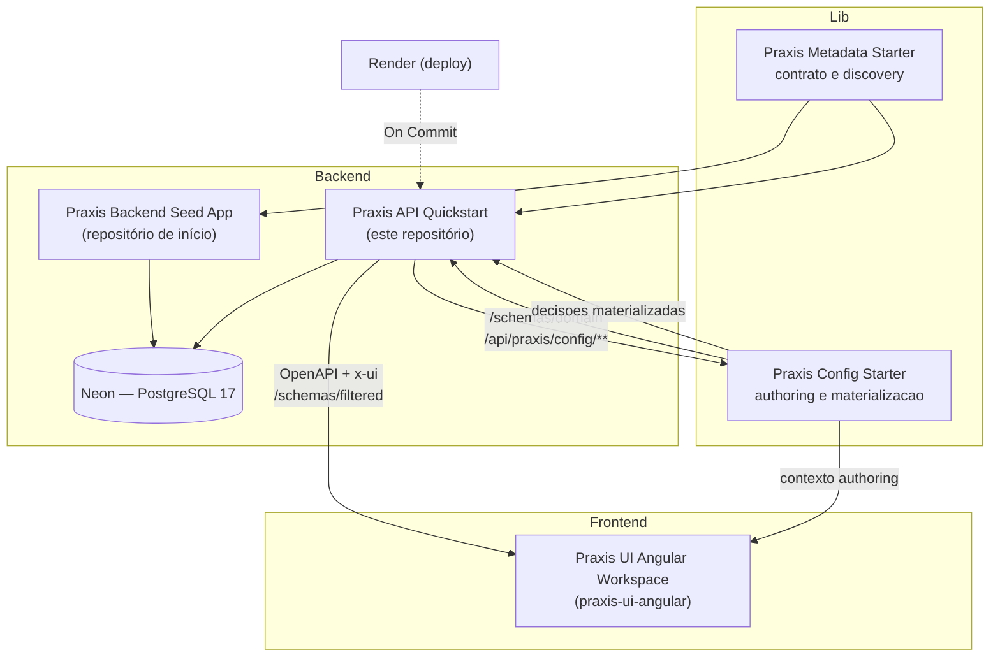
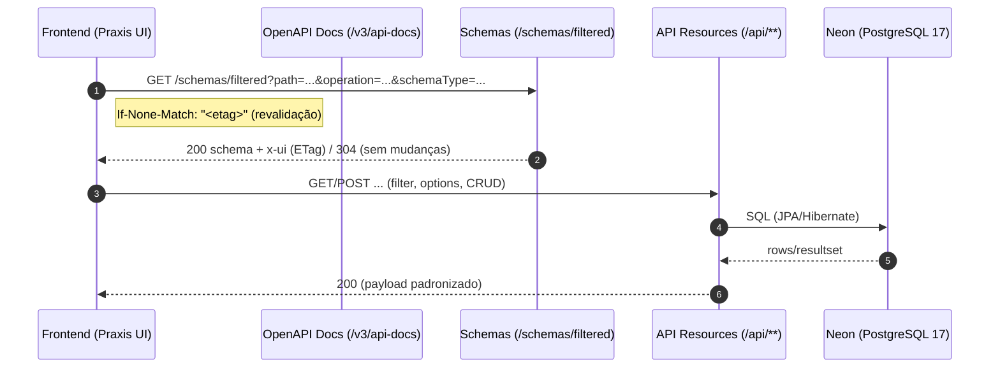

[](https://github.com/codexrodrigues/praxis-api-quickstart/actions/workflows/ci-java.yml)
[](https://spring.io/projects/spring-boot)
[](https://adoptium.net)
[](https://github.com/codexrodrigues/praxis-api-quickstart/commits)
[](LICENSE)

# API Quickstart (Praxis AI-Ready Host)


**Demo (Render)**
- Home pública: https://praxis-api-quickstart.onrender.com/
- Swagger UI: https://praxis-api-quickstart.onrender.com/swagger-ui/index.html
- Health: https://praxis-api-quickstart.onrender.com/actuator/health
- Build info: https://praxis-api-quickstart.onrender.com/actuator/info

## Sobre o Praxis (visão geral)

O Praxis e uma plataforma de decisoes semanticas authoradas por IA. Em vez de tratar a IA como geradora de JSON, patches ou configuracao incidental de componente, o backend publica intencao, vocabulario de dominio, governanca, capacidades e evidencias em runtime; a camada de config governa simulacao, aprovacao, publicacao e materializacoes derivadas.

- AI-ready host: o quickstart publica `/schemas/domain`, `@ApiResource(resourceKey=...)`, `@Operation`, `@Schema`, `@DomainGovernance`, capabilities, actions, option sources e stats para que a IA aprenda o negocio sem ler codigo-fonte.
- Semantic grounding: o catalogo emitido pelo host e ingerido em `/api/praxis/config/domain-catalog/**`, onde vira contexto recuperavel para prompt, authoring e auditoria.
- Governed authoring: regras e conhecimento adicional passam por Project Knowledge, Domain Knowledge change sets e `domain-rules` antes de qualquer materializacao.
- Materialization-driven runtime: UI, option sources, validations e workflow actions consomem decisoes publicadas; elas nao redefinem a regra de negocio.
- Contract-driven UI: `/schemas/filtered`, OpenAPI enriquecido com `x-ui`, capabilities e HATEOAS continuam sendo as superficies estruturais que o runtime oficial usa para montar tabelas, formularios, actions e dashboards.
- Evolucao segura: `ETag`/`If-None-Match`, `If-Match`, headers de schema e versoes logicas evitam quebras e preservam cache/revalidacao do contrato.

Benefícios
- A IA escolhe recursos, campos e fluxos por evidencias publicadas, nao por nomes hardcoded.
- O host demonstra como decisoes governadas sao simuladas, aprovadas, publicadas e consumidas em runtime.
- A UI oficial continua dinamica, mas como cockpit e runtime de decisoes materializadas, nao como fonte primaria da regra.
- Novos negocios podem copiar o padrao de grounding/governanca sem copiar heuristicas de RH, missoes ou procurement.

Como a UI consome o contrato
- Endpoints públicos: `/v3/api-docs` (por grupo) e `/schemas/filtered` (schema filtrado por operação: request/response).
- O `schemas/filtered` mescla metadados das anotações, Bean Validation e hints do OpenAPI.

Como a IA consome o contexto
- O host emite `GET /schemas/domain?resourceKey=<resourceKey>` a partir de metadata, OpenAPI, DTOs, governanca e capacidades.
- `scripts/ensure-domain-catalog-context.sh` ingere a release em `POST /api/praxis/config/domain-catalog/ingest`.
- `scripts/verify-domain-catalog-context.sh` valida contexto e governanca persistidos.
- `scripts/verify-domain-catalog-authoring-runtime.sh`, `scripts/verify-domain-rules-runtime.sh` e `scripts/verify-domain-knowledge-change-set-runtime.sh` provam authoring, regras governadas e conhecimento adicional em HTTP real.

## Universo dos Heróis (domínio de exemplo)

Este Quickstart usa um dominio tematico de herois para demonstrar CRUDs, relacionamentos, analytics, actions, governanca e regras de negocio em um contexto ludico e familiar.

- Plataforma: Spring Boot 3 (Java 21) + PostgreSQL 17
- Objetivo: oferecer uma base rica de dados, endpoints REST e superficies semanticas para provar o ecossistema Praxis (Metadata Starter, Config Starter e UI oficial)

Módulos principais (exemplos didáticos)
- 🧍‍♂️ Recursos Humanos — funcionários, cargos, departamentos, histórico, endereços, dependentes
- 🧠 Habilidades & Identidades — habilidades, vínculos funcionário↔habilidade, identidades secretas
- 🏰 Bases & Equipes — bases operacionais, equipes e níveis de acesso
- 🛰️ Missões & Ameaças — ameaças, missões, participantes e eventos
- 🛠️ Logística & Tecnologia — equipamentos, veículos e alocações
- ⚖️ Compliance & Incidentes — acordos, licenças, incidentes e indenizações
- 🗞️ Comunicação & Mídia — sinais de socorro, reputação, menções na imprensa

Observação: este Quickstart agora separa os recursos por domínio de rota, em vez de concentrar tudo sob `human-resources`.

- `human-resources`: `/api/human-resources/...`
- `operations`: `/api/operations/...`
- `assets`: `/api/assets/...`
- `risk-intelligence`: `/api/risk-intelligence/...`
- `demo`: `/api/demo/...`

Para uma visão detalhada (tabelas, views e cenários), veja: `docs/DEMO-DATABASE.md`.

## Ecossistema (peças e papéis)

- Praxis Metadata Starter (biblioteca)
  - Fornece anotações e bases para publicar contratos ricos: `@ApiResource`, `@ApiGroup`, `@UISchema`, `@DomainGovernance` e `@AiUsagePolicy`.
  - Enriquecimento OpenAPI com extensão x-ui, `/schemas/filtered`, `/schemas/domain`, capabilities, actions, option sources, stats e integrações JPA.
  - Principais pacotes usados aqui: `org.praxisplatform.uischema.annotation`, `org.praxisplatform.uischema.controller.base`, `org.praxisplatform.uischema.service.base`, `org.praxisplatform.uischema.filter`.
- Praxis Config Starter (biblioteca)
  - Hospeda `/api/praxis/config/**`, config-store transacional, AI registry, domain catalog, Project Knowledge, Domain Knowledge change sets e domain rules.
  - E a fronteira canonica para persistir contexto, authorar decisoes governadas, simular, aprovar, publicar e materializar regras.
- Praxis Backend Seed App (projeto)
  - Repositório “esqueleto” para iniciar um backend limpo com o Starter já integrado.
  - Link: https://github.com/codexrodrigues/praxis-backend-seed-app
- Praxis API Quickstart (este repositório)
  - Host operacional de referencia com dominios de RH, operacoes, procurement, ativos, risco e superficies de demo.
  - Demonstra `/schemas/filtered`, `/schemas/domain`, endpoints `options`, actions, documentacao OpenAPI por grupo, ingestao de catalogo, authoring, domain rules, Domain Knowledge e deploy no Render.
- Praxis UI Angular Workspace
  - Workspace Angular com bibliotecas e host de demos que consome `OpenAPI + x-ui`, capabilities e decisoes materializadas em runtime.
  - Link: https://github.com/codexrodrigues/praxis-ui-angular

Para detalhes do domínio e do banco de demonstração, consulte: `docs/DEMO-DATABASE.md`.

### Diagrama do ecossistema


## Onde este projeto se encaixa

- Host operacional de referencia: prova, em HTTP real, que metadata, config, AI context e runtime conseguem trabalhar juntos.
- Exemplo AI-ready: mostra como recursos publicam identidade canonica, descricoes de negocio, governanca, capabilities, option sources, stats e actions.
- Prova downstream: consome materializacoes aplicadas de `domain-rules` sem transformar services, UI ou docs em fonte primaria da regra.
- Ponto de partida para times: copie o padrao de grounding, governanca, catalogo ingerido e smokes; nao copie heuristicas do dominio de herois.
- Alternativa ao Seed: se preferir começar “do zero”, use o Seed. Se quer um exemplo completo para aprender o padrao operacional, use este Quickstart.

## Fluxo de alto nível (contract-driven)

Leitura correta do baseline atual:

- `/schemas/filtered` continua sendo a superfície estrutural canônica para request/response schema.
- `GET /{resource}/capabilities` e `GET /{resource}/{id}/capabilities` publicam `capabilities.operations`, que governa a semântica mínima de `create`, `view`, `edit` e `delete`.
- o runtime oficial resolve a execução por `capabilities.operations + _links + /schemas/filtered`, sem exigir que o host remonte `schemaUrl/submitUrl/submitMethod` localmente para o CRUD canônico.

- A UI solicita schema: `GET /schemas/filtered?path=<resource>&operation=<op>&schemaType=<request|response>`.
- O backend responde com contrato enriquecido (inclui `x-ui`, validações e metadados); usa `ETag/If-None-Match` para revalidar.
- A UI renderiza componentes adequados (por `FieldControlType`) e chama endpoints do recurso (`/filter`, `options/filter`, `options/by-ids`, CRUD...).

### Diagrama (contract-driven)


## Mapa do código (este repo)

- Aplicação: `src/main/java/com/example/praxis/apiquickstart/ApiQuickstartApplication.java`
- Segurança: `src/main/java/com/example/praxis/apiquickstart/config/SecurityConfig.java` — Swagger, Home e Health públicos; `/api/praxis/config/**` público para config-store/IA; demais rotas controladas por sessão JWT + flags `read-open`/whitelist.
- Paths da API: `src/main/java/com/example/praxis/apiquickstart/constants/ApiPaths.java` — prefixos como `/api/human-resources/...`, `/api/operations/...`, `/api/assets/...`, `/api/risk-intelligence/...` e `/api/demo/...`.
- Propriedades: `src/main/resources/application.properties` (base), `src/main/resources/application-dev.properties`, `src/main/resources/application-prod.properties`.
- Página pública: `src/main/resources/static/index.html` e assets em `src/main/resources/static/assets/`.

Projeto Spring Boot com `praxis-metadata-starter` + `praxis-config-starter`, pronto para consumir variáveis de ambiente e conectar em PostgreSQL (Neon), com perfis `dev` e `prod`.

## Dependências chave
- `io.github.codexrodrigues:praxis-metadata-starter` — auto-configuração, `/schemas/filtered` e enriquecimento OpenAPI x-ui.
- `io.github.codexrodrigues:praxis-config-starter` — config-store transacional (`ui_user_config`), AI context e endpoints de orquestração IA.
- `org.springframework.boot:spring-boot-starter-data-jpa`
- `org.postgresql:postgresql`
- `org.springframework.boot:spring-boot-starter-security` (CSRF, headers e filtros)
- `org.springframework.boot:spring-boot-starter-actuator` (health checks)

## Perfis e variáveis
- Base: `src/main/resources/application.properties` — Swagger e propriedades do starter.
- Dev: `src/main/resources/application-dev.properties` — usa envs (SEM fallback para `DATABASE_URL`).
- Prod: `src/main/resources/application-prod.properties` — usa envs para produção.

Variáveis por perfil:
- Dev:
  - `SPRING_DATASOURCE_URL` (use `jdbc:postgresql://localhost:5432/neondb?sslmode=disable`)
  - `SPRING_DATASOURCE_USERNAME` (padrão: `postgres`)
  - `SPRING_DATASOURCE_PASSWORD` (padrão: `postgres`)
  - `DB_POOL_SIZE` (opcional)
  - JPA/Hibernate: `spring.jpa.hibernate.ddl-auto=none` (já configurado) para evitar DDL em cima do schema do dump
  - Segurança: `app.security.csrf.disable=true` (já configurado) para evitar 403 em POST/PUT/DELETE quando o front ainda não envia `X-XSRF-TOKEN`
- Prod:
  - `SPRING_DATASOURCE_URL` (preferida) ou `DATABASE_URL` (fallback)
  - `SPRING_DATASOURCE_USERNAME`
  - `SPRING_DATASOURCE_PASSWORD`
  - `DB_POOL_SIZE` (opcional)

Arquivos de exemplo para preenchimento:
- `.env.dev.example`
- `.env.prod.example`

## Neon: converter DSN em JDBC
DSN fornecida pelo provedor (não comitar segredos nem host de ambiente real):
```
postgresql://<db-user>:<db-password>@<neon-host>/<db-name>?sslmode=require&channel_binding=require
```
JDBC correspondente para `SPRING_DATASOURCE_URL`/`CONFIG_DATASOURCE_URL` (remova `channel_binding` — o driver JDBC não utiliza):
```
jdbc:postgresql://<neon-host>/<db-name>?sslmode=require
```
Vars:
```
SPRING_DATASOURCE_URL=jdbc:postgresql://<neon-host>/<db-name>?sslmode=require
SPRING_DATASOURCE_USERNAME=<db-user>
SPRING_DATASOURCE_PASSWORD=<db-password>
```

### Flyway (incluindo migrations do Config Starter)
- As migrations do `praxis-config-starter` vivem em `classpath:db/migration` (ex.: V5 `ui_user_config` para customizações de UI).
- Para rodar direto no Neon com essas migrations:
```bash
./mvnw -DskipTests \
  -Dflyway.locations=classpath:db/migration \
  -Dflyway.url="jdbc:postgresql://<neon-host>/<db-name>?sslmode=require" \
  -Dflyway.user="<db-user>" \
  -Dflyway.password="<db-password>" \
  flyway:migrate
```
- Notas rápidas (humanos e IA):
  - `flyway.locations=classpath:db/migration` garante que todas as versões do starter sejam aplicadas (incluindo V5).
  - A nova API de user-config usa ETag/If-Match; mantenha cabeçalhos no cliente para evitar sobrescritas.
  - Após V5, o schema no Neon inclui `ui_user_config` (persistência transacional de customizações por tenant/usuário/ambiente).

#### Domain Knowledge Layer V18

Antes de habilitar a projeção `praxis.domain-knowledge.projection.enabled=true`
em qualquer ambiente, valide o alvo do config-store com:

```bash
SPRING_DATASOURCE_URL="<jdbc-url>" \
SPRING_DATASOURCE_USERNAME="<user>" \
SPRING_DATASOURCE_PASSWORD="<password>" \
scripts/validate-domain-knowledge-v18-readiness.sh
```

O script executa apenas leituras em transação read-only e imprime:

- banco, usuário e schema efetivos;
- últimas versões registradas no `flyway_schema_history`;
- presença de `domain_catalog_release` e `domain_catalog_item`;
- presença das tabelas `domain_knowledge_*` criadas pela V18.

Em 2026-04-22, o alvo de migração operacional foi validado em V17, a V18 foi
aplicada via Flyway, e a validação pós-migração confirmou as seis tabelas da
camada de conhecimento.

## Render (produção)
No dashboard do Render, defina as variáveis de ambiente:
- `SPRING_PROFILES_ACTIVE=prod`
- `SPRING_DATASOURCE_URL` (JDBC)
- `SPRING_DATASOURCE_USERNAME`
- `SPRING_DATASOURCE_PASSWORD`
- `DB_POOL_SIZE` (opcional)

Segurança (sessão por cookie):
- `PRACTICE_TEMP_PASSWORD` — senha do usuário `admin` (usada no `/auth/login`)
- `APP_JWT_SECRET` — segredo forte (≥32 bytes) para assinar o JWT
- `APP_JWT_EXP_MIN` — expiração em minutos (ex.: `60`)
- `CORS_ALLOWED_ORIGINS` — origem da UI (ex.: `https://praxis-ui-4e602.web.app`)
- `APP_SESSION_SECURE=true` — obrigatório em produção (HTTPS)
- `APP_SESSION_SAMESITE=None` — se a UI estiver em outro domínio
- `APP_SESSION_COOKIE_NAME=SESSION` (opcional)

LLM / Embeddings (OpenAI):
- `EMBEDDING_PROVIDER=openai`
- `PRAXIS_AI_OPENAI_API_KEY` — chave OpenAI principal (ou `OPENAI_API_KEY` como fallback)
- `SPRING_AI_OPENAI_CHAT_OPTIONS_MODEL` — modelo de chat (ex.: `gpt-5-mini`)
- `SPRING_AI_OPENAI_EMBEDDING_OPTIONS_MODEL` — modelo de embedding (ex.: `text-embedding-3-large`)
- `PRAXIS_AI_PROVIDER_FALLBACK_ENABLED` — habilita fallback entre provedores/modelos em falhas recuperáveis como rate limit, timeout, capacidade e erro 5xx
- `PRAXIS_AI_PROVIDER_FALLBACK_CANDIDATES` — candidatos em ordem, no formato `provider` ou `provider:model` (ex.: `gemini:gemini-2.0-flash,openai:gpt-5-mini`)
- `PRAXIS_AI_GEMINI_MODEL` — modelo Gemini principal (ex.: `gemini-2.5-flash`)
- `PRAXIS_AI_GEMINI_FALLBACK_MODELS` — modelos Gemini alternativos usados pelo adaptador do provider antes do fallback entre provedores
- `PRAXIS_AI_GEMINI_JSON_MIN_OUTPUT_TOKENS` — orçamento mínimo de saída para respostas JSON estruturadas do Gemini

Opcionalmente, se o provedor expõe `DATABASE_URL` (DSN), mantenha também `SPRING_DATASOURCE_URL` com a versão JDBC.

### Segurança (SPA-friendly, sem IdP)
- Swagger/OpenAPI continuam públicos (dev e prod), assim como Home e Health.
- `POST /auth/login` emite cookie HttpOnly (`SESSION`) com JWT (sem IdP/BFF).
- Por padrão deste repositório:
  - `/api/praxis/config/**` é público (integração config-store/RAG);
  - `GET/HEAD` de `/api/**` ficam públicos quando `APP_SECURITY_READ_OPEN=true`;
  - com `APP_SECURITY_READ_OPEN=true`, também ficam públicos `POST /api/*/*/filter`, `/filter/cursor`, `/locate`, `/filtered`, `/options/**` e `/stats/**`;
  - `GET /schemas/**` e `POST /schemas/filtered` ficam públicos quando `APP_SECURITY_SCHEMAS_AGGREGATOR_ENABLED=true`;
  - `GET/HEAD` da whitelist (`APP_SECURITY_READ_OPEN_WHITELIST`) podem ficar públicos quando configurados;
  - demais rotas exigem sessão autenticada.
  - valor padrão de `APP_SECURITY_READ_OPEN_WHITELIST`: vazio.
- Rate limit padrao do host:
  - `APP_RATE_LIMIT_PUBLIC_READ_LIMIT=600`
  - `APP_RATE_LIMIT_PUBLIC_QUERY_LIMIT=240`
  - `APP_RATE_LIMIT_CONFIG_LIMIT=240`
  - `APP_RATE_LIMIT_LOGIN_LIMIT=10`
  - `APP_RATE_LIMIT_BULK_ACTION_LIMIT=5`
- Fluxo simples:
  - `POST /auth/login` com `{"username":"admin","password":"<env>"}` → retorna `204` e envia cookie `SESSION` (HttpOnly) com JWT (expiração configurável via `APP_JWT_EXP_MIN`).
  - Requisições subsequentes usam o cookie automaticamente (Angular: `withCredentials: true`).
  - `POST /auth/logout` apaga o cookie de sessão.
  - `GET /auth/session` retorna `204` quando autenticado (útil para checar sessão do frontend).
- CSRF: quando `app.security.csrf.disable=false`, usa `CookieCsrfTokenRepository` com handler SPA compatível com Spring Security 6. O frontend deve enviar o cookie `XSRF-TOKEN` de volta no header `X-XSRF-TOKEN`; Angular faz isso automaticamente via `HttpClientXsrfModule` quando `withCredentials: true` estiver habilitado.
- CORS: configure `CORS_ALLOWED_ORIGINS` (dev pode usar `*`; para enviar cookies, defina a origem exata, ex.: `http://localhost:4200` em dev e `https://praxis-ui-4e602.web.app` em prod).

Exemplos rápidos:
```
curl -i https://praxis-api-quickstart.onrender.com/actuator/health
# → 200 OK (público)

curl -i -X POST https://praxis-api-quickstart.onrender.com/api/human-resources/funcionarios/filter \
  -H 'Content-Type: application/json' \
  -d '{}'
# → 401 Unauthorized (sem cookie)

curl -i -X POST \
  -H 'Content-Type: application/json' \
  -d '{"username":"admin","password":"'$PRACTICE_TEMP_PASSWORD'"}' \
  https://praxis-api-quickstart.onrender.com/auth/login
# → 204 No Content + Set-Cookie: SESSION=...

# Após login, reutilize o cookie (ex.: com curl -b/-c ou no browser)
curl -i -b cookies.txt -c cookies.txt \
  https://praxis-api-quickstart.onrender.com/api/human-resources/funcionarios
# → 200 OK (autenticado)
```

### URLs públicas (Render)
- URL pública do Swagger UI: https://praxis-api-quickstart.onrender.com/swagger-ui/index.html
 - Home pública: https://praxis-api-quickstart.onrender.com/
 - Build info público para diagnosticar rollout por HTTP: `/actuator/info`
 - A documentação OpenAPI usada pelo UI também está pública: `/v3/api-docs` e `/v3/api-docs/**`.
 - Endpoints de configuração/IA (`/api/praxis/config/**`) são públicos por desenho; acesso às demais rotas depende das flags de segurança (`read-open` e whitelist).
 - O endpoint `/actuator/info` deve expor ao menos `build.artifact` e `build.version`; use esse payload para confirmar se o Render realmente subiu o artefato esperado antes de diagnosticar endpoints faltando.

### Capturas de tela
- Em breve: screenshots da Home e do Swagger UI renderizados em produção.

## Rodar local
Este quickstart usa os starters alinhados ao ciclo corrente:

- Metadata: `io.github.codexrodrigues:praxis-metadata-starter:8.0.0-rc.17`
- Config: `io.github.codexrodrigues:praxis-config-starter:0.1.0-rc.38`
- UI Angular: `@praxisui/*:8.0.0-beta.19`

1) Build (repo standalone)
```
./mvnw -B -DskipTests package
# ou
mvn  -B -DskipTests package
```

Smoke local opcional dos endpoints de `stats/*`:
```
PRAXIS_EXTERNAL_SMOKE_TESTS=true ./mvnw test -Dtest=VwStatsSmokeHttpTest
```

Notas:
- esse smoke sobe o contexto completo e depende da infraestrutura externa configurada para banco/config-store;
- ele é destinado a validação local/manual e não faz parte da suíte padrão de CI;
- sem `PRAXIS_EXTERNAL_SMOKE_TESTS=true`, o teste é ignorado por desenho.
- a suíte padrão de CI deve usar H2 em memória e `spring.flyway.enabled=false` para testes de integração; `IntegrationTestIsolationPolicyTest` falha se um novo teste Spring tentar herdar o datasource remoto sem estar marcado como smoke externo.

2) Executar (dev):
```
# carrega .env.dev.example manualmente ou exporte variáveis
SPRING_PROFILES_ACTIVE=dev \
SPRING_DATASOURCE_URL=jdbc:postgresql://localhost:5432/praxis?sslmode=disable \
SPRING_DATASOURCE_USERNAME=postgres \
SPRING_DATASOURCE_PASSWORD=postgres \
java -jar target/praxis-api-quickstart-2.0.0-rc.9.jar
```
Swagger UI: http://localhost:8088/swagger-ui/index.html

## Endpoints úteis
- Home pública: `http://localhost:8088/`
- Swagger UI: `http://localhost:8088/swagger-ui/index.html`
- Health check: `http://localhost:8088/actuator/health`
- Schemas enriquecidos (exemplo): `/schemas/filtered?path=/api/human-resources/funcionarios&operation=post&schemaType=request`
- Autenticação: `POST /auth/login` (body `{username,password}`) e `POST /auth/logout`

### Integração Angular (dev)
- CORS: defina `CORS_ALLOWED_ORIGINS=http://localhost:4200`
- Cookies: use `withCredentials: true` em chamadas HTTP
- CSRF: configure `HttpClientXsrfModule.withOptions({ cookieName: 'XSRF-TOKEN', headerName: 'X-XSRF-TOKEN' })`
- Fluxo:
  - POST `/auth/login` com credenciais (`admin` / `$PRACTICE_TEMP_PASSWORD`)
  - Em seguida, use `/api/**` normalmente; o cookie `SESSION` será enviado automaticamente
 - Proxy em dev: mapeie `/api` e `/schemas` para o backend (ex.: `http://localhost:8088`). Veja `docs/security-overview.md`.

### Segurança: visão geral e boas práticas
- Consulte `docs/security-overview.md` para:
  - Entender as flags (`read-open`, `whitelist`, `write-disabled`, `schemas-aggregator.enabled`)
  - Lista de endpoints públicos por perfil
  - Armadilhas de PathPattern (evite `/**/` no meio do path)

## Padrões de SELECTs e Filtros (Options)

Quando usar `POST /{resource}/options/filter`
- Preencher selects/multi-select/autocomplete com projeção leve `OptionDTO{id,label,extra}`.
- Vantagens: payload mínimo, paginação, filtros tipados (usa o mesmo FilterDTO do recurso).
- Como configurar no `@UISchema` (campos relacionais):
  - `controlType=SELECT` (ou equivalente)
  - `endpoint="/api/.../{resource}/options/filter"`
  - `valueField="id"`, `displayField="label"`

Quando NÃO usar endpoint (Enums)
- Campos `enum` em filtros/DTOs não precisam de `endpoint`: as opções do `SELECT` vêm do próprio schema OpenAPI (lista `enum`).
- Para `array` de `enum`, a UI renderiza multi‑select automaticamente.
- Exemplo prático: `statusIn`/`statusNotIn` em Equipe usam `IN/NOT_IN` sem endpoint extra.

Convenção de labels para IN/NOT_IN
- Use labels didáticos para distinguir inclusão/exclusão no UI:
  - `label = "Status (incluir)"` para `statusIn`
  - `label = "Status (excluir)"` para `statusNotIn`
  - Aplique o mesmo padrão para outros enums: `Prioridade (incluir)`, `Prioridade (excluir)`, etc.

Quando usar `GET /{resource}/options/by-ids`
- Reidratar opções por IDs já conhecidos (pré‑seleção, chips) preservando a ordem.
- Limites: respeita `praxis.query.by-ids.max`.

Quando usar `POST /{resource}/filter` (não options)
- Listagens “ricas” (tabelas/grades) que precisam do DTO completo.
- Para diálogos de seleção com muitos atributos visíveis, prefira `/filter`.

Boas práticas
- Grandes datasets: use `/options/filter` com o FilterDTO alvo (ex.: busca por nome/código).
- Pré‑seleção: reidrate com `/options/by-ids` (ordem garantida).
- Mantenha `size` moderado; utilize `X-Data-Version` para cache de listas.

### Cascata canonica com `dependencyFilterMap`

O quickstart tambem publica um exemplo real de cascata metadata-driven para `x-ui.optionSource.dependsOn`.

No recurso analitico `vw-analytics-folha-pagamento`, o campo `payrollProfile` depende de `competenciaBetween` e `universo`. A UI observa o campo `universo`, mas o endpoint de option-source filtra por `universoContexto`. Essa traducao e publicada no contrato como:

```json
{
  "optionSource": {
    "key": "payrollProfile",
    "dependsOn": ["competenciaBetween", "universo"],
    "dependencyFilterMap": {
      "universo": "universoContexto"
    }
  }
}
```

Payload efetivo enviado ao endpoint depois da traducao do runtime Angular:

```json
{
  "competenciaBetween": {
    "start": "2026-01-01",
    "end": "2026-12-31"
  },
  "universoContexto": "Marvel",
  "search": "exec"
}
```

Endpoint de referencia:

```text
POST /api/human-resources/vw-analytics-folha-pagamento/option-sources/payrollProfile/options/filter
```

Use esse exemplo quando o campo publicado no schema e o nome aceito pelo filtro backend forem diferentes. Nao replique essa traducao em consumidores Angular; publique `dependencyFilterMap` no contrato `x-ui.optionSource`.

### Exemplos rápidos de Options

Funcionários (options paginadas)
```
curl -s -X POST 'http://localhost:8088/api/human-resources/funcionarios/options/filter?page=0&size=10' \
  -H 'Content-Type: application/json' \
  -d '{"nomeCompleto":"ana"}' | jq .
```

Funcionários (reidratar por IDs com ordem preservada)
```
curl -s 'http://localhost:8088/api/human-resources/funcionarios/options/by-ids?ids=3,1,2' | jq .
```

Folhas de Pagamento (filter completo para tabelas)
```
curl -i -s -X POST 'http://localhost:8088/api/human-resources/folhas-pagamento/filter?page=0&size=5' \
  -H 'Content-Type: application/json' \
  -d '{"ano": 2024}' | sed -n '1,40p'
```
Observação: verifique o cabeçalho `X-Data-Version` na resposta para estratégias de cache.

### Ações em lote (Eventos de Folha)

O recurso piloto `eventos-folha` já usa o core resource-oriented novo do starter:
- CRUD canônico via `AbstractResourceController`
- discovery semântico via `/schemas/surfaces`
- workflow tipado via `/schemas/actions` e `POST /actions/bulk-approve`
- exportação de coleção via `POST /export`
- snapshot agregado via `/capabilities`, incluindo `operations`

Conceitos de plataforma que este piloto coloca em prática:
- `resource-oriented`: o recurso continua sendo a fonte de verdade do contrato, payload e schema
- `surface`: descreve semanticamente uma experiência de UI sobre uma operação real, sem virar um contrato paralelo
- `workflow action`: modela um comando de negócio explícito, em vez de disfarçar a intenção como CRUD
- `capability snapshot`: agrega o que está disponível agora para a UI sem substituir os catálogos dedicados
- `capabilities.operations`: publica a semântica mínima de `supported`, `scope`, `preferredMethod`, `preferredRel` e `availability` para o CRUD canônico
- `collection export`: preserva escopo, seleção, filtros, ordenação e campos para componentes como Table e List, usando a SPI canônica do `praxis-metadata-starter`
- `self-describing API`: publica contrato estrutural e discovery semântico em runtime, em vez de depender de convenção local do frontend
- `HATEOAS`: transforma links em affordances HTTP reais, para que o cliente navegue a superfície publicada em vez de reconstruir paths ad hoc

Objetivo prático desses conceitos neste host:
- provar o baseline canônico do backend antes de qualquer customização de Angular
- evitar que o consumidor tenha de inventar semântica local para descobrir telas e ações
- separar claramente contrato estrutural (`/schemas/filtered`) de discovery semântico (`surfaces`, `actions`, `capabilities`)
- provar que o runtime oficial pode inferir `create/view/edit/delete` a partir de `resourcePath + capabilities.operations + _links`
- provar que o runtime oficial pode executar exportação remota por `POST /{resource}/export`
- demonstrar que `bulk-approve` é uma `workflow action` tipada, não um `PATCH` oportunista escondido no recurso
- fornecer um host operacional de referência para o runtime oficial e para assistentes/clients semânticos

Endpoint real de integração com a UI:
```
POST /api/human-resources/eventos-folha/actions/bulk-approve
{
  "ids": [1,2,3]
}
→ {
  "status": "success",
  "data": {
    "total": 3,
    "processed": 3,
    "failed": 0,
    "details": [{"id":1,"ok":true}, ...]
  }
}
```

Endpoint canônico de exportação remota:
```
POST /api/human-resources/eventos-folha/export
{
  "format": "csv",
  "scope": "selected",
  "selection": {
    "keyField": "id",
    "selectedKeys": [1]
  },
  "fields": [
    { "key": "id" },
    { "key": "descricao" },
    { "key": "valor" }
  ]
}
```

O piloto `eventos-folha` usa `CollectionExportExecutor` do starter e suporta os engines padrão
`csv` e `json`. Formatos como `excel`, `pdf` e `print` continuam parte do contrato público, mas
exigem engine adicional registrado no host ou versão futura do starter.

Em `GET /api/human-resources/eventos-folha/capabilities`, o piloto tambem publica
`operations.export.formats = ["csv", "json"]`, os escopos `auto`, `selected`, `filtered`,
`currentPage` e `all`, `maxRows.csv = 500`, `maxRows.json = 500` e `async = false`. A UI deve usar
esses detalhes para esconder formatos ou escopos que o recurso nao consegue produzir agora.
Esse limite e aplicado no servidor mesmo quando o cliente omite `maxRows` ou solicita valor maior. Quando
a resposta inline for parcial, o host retorna `X-Export-Truncated`, `X-Export-Max-Rows`,
`X-Export-Candidate-Row-Count` e `X-Export-Warnings` para que a UI sinalize exportacao truncada. Campos
fora da allowlist exportavel do recurso retornam `400 Bad Request`.

Contrato operacional do piloto externo:
- o piloto externo não faz enforcement RBAC no workflow; o login demo segue emitindo `SESSION` autenticada, sem authority específica da action;
- a action também exige `allowedStates = ["PENDENTE"]`; se um item já estiver `APROVADO` ou `REJEITADO`, ele volta em `details` com erro de estado, sem side effect.

Discovery canônico do piloto:
```
GET /schemas/surfaces?resource=human-resources.eventos-folha
GET /schemas/actions?resource=human-resources.eventos-folha
GET /api/human-resources/eventos-folha/actions
GET /api/human-resources/eventos-folha/capabilities
POST /api/human-resources/eventos-folha/export
```

Leitura correta dessas superfícies:
- `/schemas/surfaces` publica semântica de experiência e não substitui o schema estrutural
- `/schemas/actions` publica comandos de negócio explicitamente tipados
- `/capabilities` agrega o snapshot atual de operações, surfaces e actions
- `canonicalOperations.export` indica a existência operacional de `POST /export`, sem redefinir o schema estrutural
- `capabilities.operations.delete` item-level não deve ser inferido a partir de `DELETE /batch` nem de workflow actions destrutivas
- `_links` em `RestApiResponse` devem ser tratados como affordances reais da API publicada, não como detalhe cosmético

Segurança (POST):
- Em ambientes com `app.security.write-disabled=true`, POST é negado por padrão.
- Para fins de demonstração/local, habilite somente esse caminho definindo: `app.security.demo-allow-bulk-actions=true`.
- Endpoints de `filters/options/filtered` continuam liberados conforme `read-open`.

Persistência de status (DB migration)
- Adicione a coluna `status` na tabela `eventos_folha` (default `PENDENTE`) para permitir `bulk-approve` com validação real de estado:
  - Script e instruções: `docs/DB-MIGRATIONS.md`

### Schemas enriquecidos (/schemas/filtered)
- Solicita o schema do endpoint informando `path`, `operation` (get|post|put|delete) e `schemaType` (request|response).
- Exemplo (schema de request para criar funcionário):
  - `/schemas/filtered?path=/api/human-resources/funcionarios&operation=post&schemaType=request`

Por trás dos panos
- O backend calcula e devolve ETag do schema; o client revalida com `If-None-Match` para minimizar transferências.
- Defaults do `@UISchema` podem ser sobrescritos por valores explícitos, Bean Validation e `extraProperties`.

### Options (combos leves)
- Endpoints padrão fornecidos pelos controllers base:
  - `POST {resource}/options/filter` — pagina opções por filtro; retorna `{id,label}`.
  - `POST {resource}/options/by-ids` — retorna opções por IDs.
- Exemplos:
  - `POST /api/human-resources/funcionarios/options/filter`
  - `POST /api/human-resources/folhas-pagamento/options/by-ids`

### Novos recursos (HR)
- Cargos: `/api/human-resources/cargos`
- Departamentos: `/api/human-resources/departamentos`
- Funcionários: `/api/human-resources/funcionarios`
- Endereços: `/api/human-resources/enderecos`
- Dependentes: `/api/human-resources/dependentes`
- Folhas de Pagamento: `/api/human-resources/folhas-pagamento`
- Eventos da Folha: `/api/human-resources/eventos-folha`
- Férias/Afastamentos: `/api/human-resources/ferias-afastamentos`

### Exemplo de cURL (filter)
```
curl -s -X POST 'http://localhost:8088/api/human-resources/folhas-pagamento/filter?page=0&size=5' \
  -H 'Content-Type: application/json' \
  -d '{"ano": 2024, "funcionarioId": 1}' | jq .
```

### Exemplo de cURL (options)
```
curl -s -X POST 'http://localhost:8088/api/human-resources/funcionarios/options/filter?page=0&size=10' \
  -H 'Content-Type: application/json' \
  -d '{}' | jq .
```

## Notas
- `ddl-auto`: `none` (dev) e `validate` (prod), conforme `application-dev.properties`/`application-prod.properties`.
- Se um provedor fornecer apenas `DATABASE_URL` no formato DSN, converta para JDBC antes de setar `SPRING_DATASOURCE_URL`.
- Dependência no Maven Central: `io.github.codexrodrigues:praxis-metadata-starter` (nenhuma etapa prévia de build local é necessária).
- `io.github.codexrodrigues:praxis-config-starter` está alinhado ao corte local `0.1.0-rc.38`; este quickstart acompanha o release candidate usado para validar os contratos atuais no host operacional de referência antes de qualquer publicação externa.
- Este quickstart deve consumir a versão mais recente do starter disponível para o ciclo corrente para refletir no host operacional os contratos atuais de `ETag`, `If-None-Match`, `If-Match`, `412 Precondition Failed` e authoring AI em `/api/praxis/config/**`.
- Este quickstart ativa explicitamente `praxis.ai.authoring.reference-ui-composition-provider-enabled=true` porque e o host de referencia que demonstra composicoes ricas de RH/folha. O `praxis-config-starter` generico nao registra esse provider por padrao; hosts reais devem alimentar authoring por catalogo, contexto semantico e providers proprios quando precisarem de planos especializados.

### Validação downstream do AI patch
Para releases do `praxis-config-starter`, este quickstart agora possui dois níveis distintos de validação para `/api/praxis/config/ai/patch`:

- `SecurityConfigAiPatchPolicyTest`: cobre apenas a policy do host com controller dummy. Ele prova que o path é permitido pela chain do quickstart, mas não prova o comportamento do endpoint real do starter.
- `AiPatchSchemaResolutionIsolatedIntegrationTest`: sobe o endpoint real `/api/praxis/config/ai/patch` e valida a propagação HTTP de `SCHEMA_NOT_FOUND` em modo isolado de CI.
- O mesmo smoke isolado também envia `contextHints.domainCatalog` no payload HTTP e captura o `AiOrchestratorRequest` recebido pela camada de authoring, garantindo que o host preserva os hints de catálogo/governança que a UI ou um agente LLM precisa passar para o starter, incluindo `serviceKey`, `resourceKey`, `artifactKind`, `targetLayer` e hints de relacionamentos federados.
- O envelope `contextHints.domainCatalog` possui contrato em [`docs/contracts/domain-authoring-context-hints.schema.json`](docs/contracts/domain-authoring-context-hints.schema.json), exemplo em [`payloads/domain_authoring_context_hints.example.json`](payloads/domain_authoring_context_hints.example.json), gate estrutural em `DomainAuthoringContextHintsContractTest` e smoke runtime em `scripts/verify-domain-catalog-authoring-runtime.sh`. Esse contrato do quickstart deve espelhar o `AiDomainCatalogContextHint` canonico do `praxis-config-starter`; campos como `artifactKind`, `targetLayer` e `governance` sao extensoes opcionais para chamadas diretas de autoria. O smoke runtime cobre dois caminhos: descoberta para dashboard de folha de pagamento e autoria de regra de formulario/LGPD, exigindo `intent=authoring`, `itemTypes`, `recommendedAuthoringFlow=shared_rule_authoring` e, quando disponivel, `recommendedRuleType` para semear a trilha de `domain-rules/simulations`. O mesmo smoke tambem pode provar o primeiro corte de governanca de contexto semantico para LLM authoring: com `REQUIRE_GOVERNED_CONTEXT=true` e uma chave LLM configurada, ele chama `/api/praxis/config/ai/authoring/intent-resolution` com `includeLlmDiagnostics=true` e exige `llmDiagnostics.request.contextBundle.governedDomainContext.resolutionStatus=resolved`, emitindo `domainContextGovernanceAuthoringSeen=true`. Enquanto o host publicado ainda estiver em rollout, o smoke aceita em modo `REQUIRE_AUTHORING_FLOW=auto` o hint legado `recommendedOperation=rule.visualBlockGuidance.add` apenas como evidencia temporaria de materializacao visual antiga, nao como fluxo canonico de autoria.
- A persistencia da regra compartilhavel fica separada da materializacao em `FormConfig`. O fluxo canonico de `domain-rules` passa a admitir `POST /api/praxis/config/domain-rules/intake` para abrir um draft governado antes de `simulation/definition/materialization/publication`. A resposta de `simulation` deve trazer `explainability` estruturada junto de grounding, cobertura existente, materializacoes previstas, aprovacoes requeridas e warnings, para que a explicacao oficial venha do backend. Quando `publicationReadiness=ready_to_publish`, a trilha canônica de governança avança por `POST /api/praxis/config/domain-rules/publications`, que ativa a definicao persistida e aplica materializacoes elegiveis sem exigir que o host remonte a policy de publicacao. O smoke runtime `scripts/verify-domain-rules-runtime.sh` abre primeiro um intake real em `POST /api/praxis/config/domain-rules/intake`, valida que o grounding aponta para uma definicao persistida e entao simula usando `ruleDefinitionId`; quando `/simulations` estiver disponivel, ele exige `explainability.summary`, `recommendedAction`, `publicationReadiness` e `nextSteps` antes de seguir para aprovacao e materializacao. Em seguida, ele continua com a definicao LGPD versionada e a materializacao `form_config`, e tambem prova um segundo caminho canônico de procurement com `selection_eligibility -> publications -> option_source`, exigindo `targetLayer=option_source`, `targetArtifactType=resource-option-source`, `targetArtifactKey=supplier` e `materializedPayload.kind=lookup_selection_policy`. Depois da publicacao, o smoke consulta o endpoint real de lookup de fornecedores com o tenant isolado da publicacao para provar que a materializacao aplicada governa o runtime de `option_source`, retornando `selectable=false` para um status bloqueado pela decisao publicada. O host tambem possui o hook runtime para consumir materializacoes aplicadas de `backend_validation` com `targetArtifactType=resource-validation` e `targetArtifactKey=procurement.purchase-orders`: `ProcurementPurchaseOrderService` consulta a decisao aplicada e bloqueia comandos que usem `supplierId` com status proibido. Para actions operacionais, `FolhasPagamentoService` tambem consome materializacoes aplicadas de `workflow_action` com `targetArtifactType=resource-workflow-action` e `targetArtifactKey=human-resources.folhas-pagamento:mark-paid`, provando que uma decisao governada pode bloquear uma action existente sem transformar o quickstart em fonte primaria da regra. A proxima expansao canonica e `approval_policy`: `EventosFolhaService` consome materializacoes de `targetArtifactType=resource-action-approval` para decidir se `human-resources.eventos-folha:bulk-approve` exige aprovacao, sem transformar o quickstart em fonte primaria da regra, inbox generico ou motor BPM. O smoke agora cobre `workflow_action` em `REQUIRE_WORKFLOW_ACTION=auto|true|false`, prepara `approval_policy` em `REQUIRE_APPROVAL_POLICY=auto|true|false` e valida timeline governada em `REQUIRE_TIMELINE=auto|true|false` quando o runtime expuser `GET /api/praxis/config/domain-rules/definitions/{definitionId}/timeline`: ele cria/publica as regras governadas, exige `sourceHash` derivado, valida eventos `safe` sem vazamento de prompt/condicao/payload materializado e, quando `REQUIRE_TIMELINE=true`, exige `intake.received`, `simulation.requested`, `simulation.completed`, `approval.requested` e `approval.completed` no caminho governado de `form_config`, exige `publication.requested` e `publication.completed` no caminho publicado e, quando autenticado, chama a action esperando `409 Conflict`. Com `praxis-config-starter:0.1.0-rc.36`, o smoke pode ser endurecido para `REQUIRE_BACKEND_VALIDATION=true` e `REQUIRE_TIMELINE=true`: ele cria/publica regras governadas, exige derivacao `resource_validation_policy` com `source_hash` derivado limitado por digest estavel, autentica em `/auth/login` com `PRACTICE_TEMP_PASSWORD`, prova que o comando mutavel de pedido rejeita fornecedor bloqueado com `409 Conflict` e valida a timeline canonica publicada no starter. Ele exige um runtime com as migrations `V20__create_domain_shared_rule_layer.sql`, `V22__expand_domain_rule_constraints_for_selection_eligibility.sql`, `V23__expand_domain_rule_constraints_for_workflow_action.sql` e, para `REQUIRE_APPROVAL_POLICY=true`, `V24__expand_domain_rule_constraints_for_approval_policy.sql` aplicadas; o script nao executa Flyway nem altera schema. Enquanto um host publicado especifico ainda estiver em rollout dos endpoints novos, os modos padrao `REQUIRE_SIMULATION=auto`, `REQUIRE_PUBLICATION=auto`, `REQUIRE_BACKEND_VALIDATION=auto`, `REQUIRE_WORKFLOW_ACTION=auto`, `REQUIRE_APPROVAL_POLICY=auto` e `REQUIRE_TIMELINE=auto` registram warning para gaps esperados e continuam no fluxo baseline. O workflow manual `Domain Rules Runtime Smoke` expoe os seis gates como inputs `require_simulation`, `require_publication`, `require_backend_validation`, `require_workflow_action`, `require_approval_policy` e `require_timeline`, para permitir endurecer o rollout publicado sem alterar o script. Como esse smoke escreve registros persistidos, ele usa `SMOKE_RUN_ID` com timestamp UTC por padrao e isola o caminho de `publications` em um tenant derivado desse identificador.
- Para provar somente enforcement nao visual, use `scripts/verify-domain-rules-backend-validation-runtime.sh`. Esse smoke focado cria uma decisao governada `validation`, publica a materializacao aplicada `backend_validation`/`resource_validation_policy`, autentica no host e exige que `POST /api/procurement/purchase-orders` rejeite um `supplierId` bloqueado com `409 Conflict`. Antes de executar contra um host local, empacote o quickstart atual com `./mvnw -q -DskipTests package` e confirme que o jar embute o `praxis-config-starter` esperado; um processo local antigo pode carregar starter stale e gerar falsos negativos em endpoints de procurement. Exemplo: `BACKEND_URL=http://localhost:8091 ORIGIN=http://localhost:4003 scripts/verify-domain-rules-backend-validation-runtime.sh`. Quando o host usar protecao de origem para `/api/praxis/config/**`, inicie-o com `APP_SECURITY_CONFIG_ORIGIN_RESTRICTION_ALLOWED_ORIGINS` alinhado ao `ORIGIN` do smoke.
- Para provar somente enforcement de action operacional, use `scripts/verify-domain-rules-workflow-action-runtime.sh`. Esse smoke focado cria uma decisao governada `workflow_action_policy`, publica a materializacao aplicada `workflow_action`/`workflow_action_policy`, autentica no host e exige que `POST /api/human-resources/folhas-pagamento/2/actions/mark-paid` seja bloqueado com `409 Conflict` pela policy publicada em `domain-rules`, nao por regra copiada para a UI.
- Para provar somente enforcement de aprovacao operacional, use `scripts/verify-domain-rules-approval-policy-runtime.sh`. Esse smoke focado cria uma decisao governada `approval_policy`, publica a materializacao aplicada `approval_policy`/`resource-action-approval`, autentica no host e exige que `POST /api/human-resources/eventos-folha/actions/bulk-approve` seja bloqueado com `409 Conflict`, mostrando que a exigencia de aprovacao vem da decisao publicada e nao de um inbox ou motor BPM local.
- O corte coordenado `praxis-config-starter:0.1.0-rc.36` esta documentado em [`docs/DOMAIN-RULE-TIMELINE-RC36-ROLLOUT.md`](docs/DOMAIN-RULE-TIMELINE-RC36-ROLLOUT.md). O artefato ja resolve no Maven Central, e este quickstart passa a consumi-lo como host operacional de referencia para provar timeline governada e authoring por path explicito.
- A federacao de dominio fica separada do catalogo isolado de cada servico. O smoke runtime `scripts/verify-domain-federation-runtime.sh` grava uma release candidata em `/api/praxis/config/domain-federation/ingest?dryRun=false`, consulta auditoria e validacao persistida, e ativa a release em `/api/praxis/config/domain-federation/releases/{releaseKey}/activate`. Ele exige um runtime com a migration `V21__create_domain_federation_read_model.sql` aplicada e `praxis.domain-federation.persistence.enabled=true`; o script nao executa Flyway nem altera schema.
- A escrita de Domain Knowledge tambem fica separada da leitura de contexto. O smoke runtime `scripts/verify-domain-knowledge-change-set-runtime.sh` garante catalogo persistido, cria um change set LLM com `add_evidence`, revalida, aprova com reviewer, aplica pela fronteira `/api/praxis/config/domain-knowledge/change-sets/{id}/apply` e confirma readback `applied`. Quando o runtime expuser `GET /api/praxis/config/domain-knowledge/change-sets/{id}/timeline`, o mesmo smoke valida que a timeline de auditoria retorna eventos `safe` para criacao, validacao, aprovacao e aplicacao sem vazar patch bruto, payload de evidencia, `sourcePointer`, `sourceUri`, `patchHash`, prompt ou historico de chat; use `REQUIRE_CHANGE_SET_TIMELINE=true` para endurecer esse gate em cortes que ja incluem essa superficie. Para provar reversibilidade governada no mesmo runtime, use tambem `REQUIRE_EVIDENCE_REVERT=true`: o smoke cria, valida, aprova, aplica e audita um change set `revert_evidence` sobre a evidencia criada pelo proprio fluxo, exigindo evento seguro `evidence.reverted` e sem delete fisico. Para provar que revert tambem retira influencia de IA, use `REQUIRE_PROJECT_KNOWLEDGE_RETRIEVAL=true`: o smoke prepara um conceito de Project Knowledge, prova que ele aparece no stream de authoring apos `add_evidence` e prova que desaparece depois de `revert_evidence`. Para provar tambem o caminho vector-enabled, use `REQUIRE_PROJECT_KNOWLEDGE_VECTOR_RETRIEVAL=true` com o backend iniciado com `PRAXIS_PROJECT_KNOWLEDGE_RAG_PUBLICATION_ENABLED=true`, `PRAXIS_PROJECT_KNOWLEDGE_RAG_RETRIEVAL_ENABLED=true` e vector store habilitado: o smoke exige documento derivado `project_knowledge` no `vector_store` apos `add_evidence` e ausencia/retencao correta apos `revert_evidence` ou supersession. Ele exige o quickstart empacotado com o `praxis-config-starter` que contem os endpoints de change set e `praxis.domain-knowledge.projection.enabled=true`, sem publicar Maven nem executar migrations por conta propria.
- O rollout da timeline de Domain Knowledge esta documentado em [`docs/DOMAIN-KNOWLEDGE-CHANGE-SET-TIMELINE-RC37-ROLLOUT.md`](docs/DOMAIN-KNOWLEDGE-CHANGE-SET-TIMELINE-RC37-ROLLOUT.md). Com `praxis-config-starter:0.1.0-rc.37`, o smoke pode ser endurecido para `REQUIRE_CHANGE_SET_TIMELINE=true`, validando a timeline segura publicada sem override local. O checkpoint opt-in de Project Knowledge Vector RAG esta documentado em [`docs/PROJECT-KNOWLEDGE-VECTOR-RAG-ROLLOUT.md`](docs/PROJECT-KNOWLEDGE-VECTOR-RAG-ROLLOUT.md); use esse guia para repetir a prova local antes de qualquer decisao futura de Maven Central, hosted smoke ou release gate.

Importante:
- o smoke isolado usa H2 em memória e mocks estruturais para remover dependência em banco compartilhado, pgvector, embedding externo, bootstrap de registry e cadeia dinâmica de `/schemas/filtered`;
- isso é intencional: o objetivo do teste é validar o contrato HTTP do patch AI hospedado no quickstart, não reexecutar toda a infraestrutura transversal no mesmo gate;
- a cadeia completa de OpenAPI dinâmico, `/schemas/filtered`, pgvector e retrieval continua sendo preocupação de integração mais ampla, fora desse smoke mínimo de release.

### Smoke local do authoring stream
Para validar o fluxo real do assistente no `page-builder-ia`, rode o quickstart como host de referencia do contrato de stream do `praxis-config-starter` e a UI Angular em `http://localhost:4003`.

Quando a meta for evitar GitHub Actions e rodar a cadeia viva com banco remoto e provedores LLM reais, prefira os wrappers locais:

- backend/runtime: `../praxis-config-starter/tools/local-e2e/start-quickstart-local-e2e.sh`;
- smoke HTTP/SSE: `../praxis-config-starter/tools/local-e2e/run-agentic-http-sse-smoke-local.sh`;
- catálogo de domínio: `../praxis-config-starter/tools/local-e2e/run-domain-catalog-v2-local.sh`;
- federação de domínio v0.1: `../praxis-config-starter/tools/local-e2e/run-domain-federation-v01-local.sh`;
- smoke runtime de federação no quickstart: `scripts/verify-domain-federation-runtime.sh`;
- compliance LLM: `../praxis-config-starter/tools/local-e2e/run-llm-compliance-local.sh`;
- navegador/Page Builder: `../praxis-ui-angular/tools/local-e2e/run-page-builder-agentic-full-local.sh`.
- cockpit governado de Project Knowledge no Page Builder:
  `../praxis-ui-angular/tools/local-e2e/run-project-knowledge-audit-cockpit-local.sh`.

O runbook completo fica em `../praxis-config-starter/docs/ai/local-live-e2e-without-actions.md`.

Use o cockpit governado de Project Knowledge quando precisar provar, sem
GitHub Actions, que a UI cria um change set real em
`/api/praxis/config/domain-knowledge/change-sets`, valida, aprova, aplica e le
o readback aplicado. Esse teste complementa o smoke HTTP
`scripts/verify-domain-knowledge-change-set-runtime.sh`: o smoke prova o
contrato do host, enquanto o cockpit prova a experiencia browser/local contra o
mesmo contrato canonico.

Nota sobre federação: os smokes live exigem que o jar do quickstart tenha sido empacotado com uma versão do `praxis-config-starter` que contenha `DomainFederationController`. Se o endpoint `/api/praxis/config/domain-federation/ingest?dryRun=true` retornar `404`, o host ainda está usando um starter sem essa superfície HTTP.

Ambiente recomendado para o quickstart local:

```powershell
$env:PORT='8088'
$env:APP_SECURITY_CONFIG_ORIGIN_RESTRICTION_ALLOWED_ORIGINS='http://localhost:4003'
$env:CORS_ALLOWED_ORIGINS='http://localhost:4003'
$env:PRAXIS_AI_SECURITY_CORPORATE_MODE='false'
$env:PRAXIS_AI_SECURITY_ALLOW_HEADER_IDENTITY_IN_LOCAL='true'
$env:PRAXIS_AI_STREAM_AUTH_MODE='signed-url-token'
$env:PRAXIS_AI_STREAM_AUTH_TOKEN_SECRET='<local-secret-with-at-least-32-bytes>'
```

Ambiente recomendado para a UI:

```powershell
$env:PAX_PROXY_TARGET='http://localhost:8088'
```

Por que `signed-url-token`:
- o browser `EventSource` nao permite anexar headers customizados ao `GET` de SSE;
- sem cookie corporativo, a identidade do stream precisa viajar no token assinado gerado por `POST /api/praxis/config/ai/authoring/turn/stream/start`;
- nesse modo, o `GET`/`probe` sem headers de identidade usa o token assinado como escopo canonico; quando headers explicitos forem enviados, o backend valida o token contra esses headers;
- o smoke esperado e `201` no start, `streamAuthMode=signed_url_token`, `200` no `GET /stream/{streamId}?accessToken=...` e aplicacao da pre-visualizacao sem cair no fallback `/intent-resolution`.
- `AgenticAuthoringStreamIsolatedIntegrationTest` cobre esse contrato no host com token assinado real e stream assincrono isolado por mock.

### Validação downstream de grupos OpenAPI e `/schemas/filtered`
Para releases do `praxis-metadata-starter`, este quickstart possui um smoke isolado para a cadeia de grupos OpenAPI:

- `OpenApiGroupResolutionIsolatedIntegrationTest`: sobe o host real com H2 em memória, usa o `praxis-metadata-starter` real e valida a sequência `DynamicSwaggerConfig -> OpenApiGroupResolver -> /schemas/catalog -> /v3/api-docs/{group} -> /schemas/filtered`.

O que esse teste cobre:
- registro dos grupos individuais por controller no startup;
- resolução do grupo correto para recursos CRUD e endpoints de stats;
- publicação dos links de schema no catálogo;
- recuperação do documento OpenAPI por grupo e do schema filtrado enriquecido.
- validação dos catálogos `/schemas/domain` críticos contra o contrato aceito pelo `praxis-config-starter`, incluindo governança de RH, missões, acordos regulatórios e fornecedores.

O que ele deliberadamente isola:
- migrations/Flyway reais;
- banco compartilhado externo;
- RAG/pgvector/registry do `praxis-config-starter`.

### Ingestão runtime do catálogo semântico

Depois de subir o quickstart contra o config-store, garanta o vocabulário de domínio materializado em `/schemas/domain` no `praxis-config-starter`:

Para validar apenas persistência transacional e projeção `domain_knowledge_*`, sem publicar documentos RAG nem acionar embeddings, suba o backend com `PRAXIS_DOMAIN_CATALOG_RAG_PUBLICATION_ENABLED=false` e `PRAXIS_AI_RAG_VECTOR_STORE_ENABLED=false`. Isso mantém a ingestão determinística mesmo em ambientes locais sem chave de embedding e sem exigir schema/validação do pgvector.

Exemplo de runtime transacional, sem vector store:

```bash
PORT=8088 \
SPRING_FLYWAY_ENABLED=false \
PRAXIS_DOMAIN_KNOWLEDGE_PROJECTION_ENABLED=true \
PRAXIS_DOMAIN_CATALOG_RAG_PUBLICATION_ENABLED=false \
PRAXIS_AI_RAG_VECTOR_STORE_ENABLED=false \
PRAXIS_AI_REGISTRY_BOOTSTRAP_ENABLED=false \
PRAXIS_AI_REGISTRY_HEALTH_ENABLED=false \
SPRING_AI_VECTORSTORE_PGVECTOR_INITIALIZE_SCHEMA=false \
SPRING_AI_VECTORSTORE_PGVECTOR_VECTOR_TABLE_VALIDATIONS_ENABLED=false \
./mvnw spring-boot:run
```

Nesse modo:
- `/schemas/domain` continua gerando o catálogo semântico a partir do host;
- `POST /api/praxis/config/domain-catalog/ingest` persiste o release e os itens no config-store;
- `praxis.domain-knowledge.projection.enabled=true` materializa a projeção read-only `domain_knowledge_*`;
- nenhum bean `VectorStore` deve ser criado quando `praxis.ai.rag.vector-store.enabled=false`;
- `RagChatAdvisorProperties` e `RagChatAdvisorService` continuam disponíveis para preservar o wiring do starter.

```bash
BACKEND_URL=http://localhost:8088 \
scripts/ensure-domain-catalog-context.sh human-resources.funcionarios
```

Para publicar um conjunto inicial de recursos de vários contextos:

```bash
BACKEND_URL=http://localhost:8088 \
scripts/ensure-domain-catalog-context.sh
```

Ou informe explicitamente os recursos:

```bash
BACKEND_URL=http://localhost:8088 \
scripts/ensure-domain-catalog-context.sh human-resources.funcionarios operations.missoes
```

O script:
- consulta `/api/praxis/config/domain-catalog/releases`;
- valida governança persistida por `/api/praxis/config/domain-catalog/items`;
- baixa `/schemas/domain?resourceKey=<resourceKey>` e ingere em `POST /api/praxis/config/domain-catalog/ingest` apenas quando faltar contexto;
- valida novamente por `/items`, que é o contrato determinístico usado pelos gates E2E.

Para forçar uma nova release, use:

```bash
BACKEND_URL=http://localhost:8088 \
FORCE_INGEST=true \
scripts/upload-domain-catalog-batch.sh human-resources.funcionarios operations.missoes
```

Para validar, sem nova ingestão, se o catálogo persistido ainda possui contexto de governança para os recursos críticos:

```bash
BACKEND_URL=http://localhost:8088 \
scripts/verify-domain-catalog-context.sh
```

Para validar a resiliência da ingestão de catálogos estáveis, poste o mesmo catálogo duas vezes e exija que a segunda chamada reutilize a release existente dentro do limite configurado:

```bash
BACKEND_URL=https://praxis-api-quickstart.onrender.com \
MAX_IDEMPOTENT_INGEST_MS=10000 \
scripts/verify-domain-catalog-ingest-resilience.sh human-resources.funcionarios operations.missoes
```

Esse smoke protege o fluxo observado em produção: `/schemas/domain` deve publicar `releaseKey` e `sourceHash` estáveis, `POST /api/praxis/config/domain-catalog/ingest` deve ser idempotente para o mesmo catálogo e `/api/praxis/config/domain-catalog/items` deve continuar retornando governança persistida.

Depois de habilitar `praxis.domain-knowledge.projection.enabled=true` e executar uma ingestão controlada, valide a materialização read-only na camada `domain_knowledge_*`:

```bash
CONFIG_DATASOURCE_URL="<jdbc-url>" \
CONFIG_DATASOURCE_USERNAME="<user>" \
CONFIG_DATASOURCE_PASSWORD="<password>" \
scripts/validate-domain-knowledge-projection.sh human-resources.funcionarios
```

O script não aplica migration e não ingere catálogo. Ele abre uma transação read-only, localiza a release mais recente do recurso e valida contagens mínimas de conceitos, bindings e evidências projetadas. Use `MIN_CONCEPTS`, `MIN_BINDINGS` e `MIN_EVIDENCE` para endurecer os gates por domínio.

Variáveis úteis:
- `TENANT_ID` e `ENVIRONMENT` definem o escopo persistido;
- `ORIGIN` deve bater com `app.security.config-origin-restriction.allowed-origins`;
- `VERIFY_QUERY` ajusta a busca final; no script unitário o padrão é `cpf`, enquanto o batch escolhe consultas por recurso conhecido (`cpf`, `salario` ou `status`);
- `REQUIRE_GOVERNANCE=false` permite ingerir recursos ainda sem anotações de governança.
- `RESOURCE_KEYS` permite passar uma lista separada por vírgula ou espaço para o script batch.

Validação runtime registrada em 2026-04-22:
- comando: `SPRING_FLYWAY_ENABLED=false ./mvnw spring-boot:run` e `BACKEND_URL=http://localhost:8088 scripts/ensure-domain-catalog-context.sh`;
- recursos persistidos: `human-resources.funcionarios` (426 itens, 16 governance), `human-resources.folhas-pagamento` (175 itens, 3 governance), `operations.missoes` (403 itens, 11 governance), `operations.acordos-regulatorios` (148 itens, 4 governance) e `procurement.suppliers` (117 itens, 5 governance);
- verificações finais retornaram governança para `cpf`, `salario` e `status`, cobrindo privacidade/LGPD/GDPR, dados financeiros, compliance regulatório e política interna;
- em ambiente local sem chave de embedding, prefira `PRAXIS_DOMAIN_CATALOG_RAG_PUBLICATION_ENABLED=false` e `PRAXIS_AI_RAG_VECTOR_STORE_ENABLED=false` para não tentar publicar RAG nem inicializar pgvector; a resposta de ingestão deve retornar `releaseId`, `releaseKey` e `itemCount`, e `/api/praxis/config/domain-catalog/items` deve retornar itens persistidos.
- em uma validação histórica com `praxis-config-starter:0.1.0-rc.19`, o quickstart validou `human-resources.funcionarios` em modo sem vector store: ingestão em `2:47.65`, `426` itens persistidos, governança de `cpf` com LGPD/GDPR e projeção `domain_knowledge_*` com `concepts=60`, `aliases=103`, `bindings=59`, `relationships=59` e `evidence=119`.

O contrato operacional completo desta linha está em [`docs/SEMANTIC-DOMAIN-CATALOG-CONTRACT.md`](docs/SEMANTIC-DOMAIN-CATALOG-CONTRACT.md).

O exemplo canônico AI-ready para um domínio conectado está em [`docs/AI-READY-MISSION-DOMAIN-CATALOG.md`](docs/AI-READY-MISSION-DOMAIN-CATALOG.md).

O guia operacional para analistas e LLMs criarem, explicarem e revisarem rascunhos de regras a partir do catálogo semântico está em [`docs/LLM-DOMAIN-AUTHORING-GUIDE.md`](docs/LLM-DOMAIN-AUTHORING-GUIDE.md).

## CI (GitHub Actions)

Este repositório usa CI-only (sem deploy) para build e testes com Java 21 e Maven Wrapper.

- Workflow: `.github/workflows/ci-java.yml`
- Disparos: `push` e `pull_request` na branch `main`
- Passos principais:
  - `actions/setup-java@v4` (Temurin 21, cache Maven)
  - Normalização de EOL do wrapper e `chmod +x mvnw`
  - `./mvnw -B -fae -Dstyle.color=always verify`
- Sem deploy: não há hooks, secrets ou chamadas ao Render nos workflows.

Implantação no Render (produção) deve ser configurada diretamente no painel do Render (Build/Start command e variáveis de ambiente). Não há workflow de deploy neste repositório.

## Docker (opcional)

Build da imagem e execução local sem instalar Java/Maven:
```
docker build -t praxis-api-quickstart:local .
docker run --rm -e PORT=8088 -p 8088:8088 praxis-api-quickstart:local
```
Com memória/flags JVM customizados:
```
docker run --rm \
  -e PORT=9090 -p 9090:9090 \
  -e JAVA_OPTS="-Xms256m -Xmx512m" \
  praxis-api-quickstart:local
```

## Projetos relacionados
- Seed do backend (Spring Boot): https://github.com/codexrodrigues/praxis-backend-seed-app
- UI Angular Workspace (libs + host de demos): https://github.com/codexrodrigues/praxis-ui-angular
- Portal de documentação da plataforma: `praxis-platform-docs` (neste workspace)

## Banco local (Docker)

Suba um PostgreSQL 17 local com Docker e conecte a aplicação usando o profile `dev`.

1) Subir o banco
```
docker compose -f dev/docker-compose.local.yml up -d db
# Aguarde o healthcheck ficar saudável
docker compose -f dev/docker-compose.local.yml ps
```

Credenciais padrão do compose:
- host: localhost
- port: 5432
- db: praxis
- user: postgres
- password: postgres

2) Importar um dump SQL existente
- Import automático (primeiro start):
  - Coloque o dump em `db/dump/neon-init.sql`.
  - No primeiro boot, a imagem Postgres executa os arquivos de `db/init/`:
    - `05-ensure-roles.sql` — cria roles do dump (ex.: `neondb_owner`, `praxis_service_user`, `neon_superuser`, `cloud_admin`).
    - `20-import-dump.sql` — importa o arquivo `/seed/neon-init.sql` via `\ir`.
  - Comandos:
```
docker compose -f dev/docker-compose.local.yml up -d db
```
- Import a qualquer momento (profile de seed): renomeie o dump para `neon-init.sql` (ou use `SEED_FILE=<arquivo.sql>`) e rode:
```
docker compose -f dev/docker-compose.local.yml --profile seed up -d db db-seed
# ou, para um arquivo com nome diferente:
SEED_FILE=meu-dump.sql docker compose -f dev/docker-compose.local.yml --profile seed up -d db db-seed
```
- Opção C — Import manual (qualquer momento):
```
bash scripts/db-import.sh /caminho/para/neon-init.sql
```

3) Apontar a aplicação para o banco local (dev)
- Via env (exemplo):
```
SPRING_PROFILES_ACTIVE=dev \
SPRING_DATASOURCE_URL=jdbc:postgresql://localhost:5432/neondb?sslmode=disable \
SPRING_DATASOURCE_USERNAME=postgres \
SPRING_DATASOURCE_PASSWORD=postgres \
./mvnw -B -DskipTests spring-boot:run
```
- As propriedades `application-dev.properties` já possuem esses defaults; setar as envs é opcional.

Observações
- Se já existir volume de dados (`db_data`), os scripts em `db/init` não rodam novamente (comportamento padrão do Postgres). Para reimportar, use o profile `seed` ou resete o volume.
- Para “resetar” e importar do zero: `docker compose -f dev/docker-compose.local.yml down -v && docker compose -f dev/docker-compose.local.yml up -d db` (cuidado — destrói os dados locais).
- Dumps com `CREATE DATABASE` funcionam — o compose cria a base padrão `praxis` (POSTGRES_DB), mas o dump cria e usa `neondb`. A aplicação em `dev` aponta para `neondb` por padrão.

### Solução de Problemas (Docker/Seed)
- Warnings no Windows/Compose (variáveis não definidas, `version` obsoleto): são inofensivos. A chave `version:` foi removida e o entrypoint do `db-seed` foi escapado para reduzir a verbosidade.
- Erro de mount Read-Only: não monte um arquivo diretamente em `/docker-entrypoint-initdb.d` quando já monta `db/init` como diretório. Use o `/seed` + `20-import-dump.sql` (já configurado).
- Erros no primeiro boot com `DO $$` ou roles ausentes: o fluxo foi movido para SQL puro em `05-ensure-roles.sql` (sem shell). Esse arquivo cria as roles do dump (`neondb_owner`, `praxis_service_user`, `neon_superuser`, `cloud_admin`).
- “Importou mas a API retorna []”: verifique se a aplicação está conectando em `neondb` (e não em `praxis`). Em `dev`, defina:
  - `SPRING_PROFILES_ACTIVE=dev`
  - `SPRING_DATASOURCE_URL=jdbc:postgresql://localhost:5432/neondb?sslmode=disable`
  - `SPRING_DATASOURCE_USERNAME=postgres`
  - `SPRING_DATASOURCE_PASSWORD=postgres`
- Validar dados: dentro do container, rode:
```
docker exec -it praxis-postgres psql -U postgres -d neondb -c "SELECT COUNT(*) FROM public.vw_resumo_missoes;"
docker exec -it praxis-postgres psql -U postgres -d neondb -c "SELECT missao_id,titulo,prioridade,status FROM public.vw_resumo_missoes LIMIT 5;"
```

## Higiene de commits (o que commitar)

- Commitar:
  - `src/`, `pom.xml`, `README.md`, `LICENSE`, `AGENTS.md`, `.github/`, `.mvn/wrapper/maven-wrapper.properties`, `mvnw`, `mvnw.cmd`.
- Não commitar:
  - `target/` (artefatos de build), logs (`*.log`), dumps (`hs_err_pid*`).
  - Variáveis reais de ambiente (`.env`, `.env.*`); use somente os exemplos (`.env.*.example`).
  - Pastas/arquivos de IDE: `.idea/`, `.vscode/`, `*.iml`, `.classpath`, `.project`, `.settings/`.
  - Binários gerados temporários, arquivos de merge (`*.orig`, `*.rej`), temporários de editor (`*.swp`, `*.swo`, `*~`).

Observação
- O `maven-wrapper.jar` não é commitado por padrão; o `mvnw` baixa-o automaticamente no CI quando necessário.

### Solução de Problemas (Segurança)
- Cookies/Sessão: garanta que a UI envie `withCredentials: true` (Angular) e que `APP_SESSION_SAMESITE` esteja coerente (`Lax` no dev, `None` no prod se domínios diferentes).
- CSRF: quando habilitado, o backend exige header `X-XSRF-TOKEN`. No Angular, use `HttpClientXsrfModule.withOptions({ cookieName: 'XSRF-TOKEN', headerName: 'X-XSRF-TOKEN' })` e faça um `GET` para que o cookie `XSRF-TOKEN` seja emitido (ex.: `/actuator/health`). Em dev, CSRF já vem desabilitado (`app.security.csrf.disable=true`).
### Solução de Problemas (JPA/Hibernate)
- Erro: `ERROR: cannot alter type of a column used by a view or rule` ao subir a app
  - Causa: `ddl-auto=update` tenta alterar tipos que o dump fixou e que possuem dependências (views).
  - Correção: em `dev`, usamos `spring.jpa.hibernate.ddl-auto=none` (já aplicado). Se estiver usando env, defina `SPRING_JPA_HIBERNATE_DDL_AUTO=none`.
